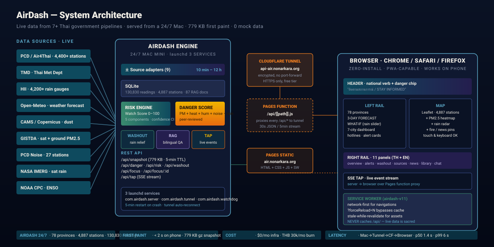
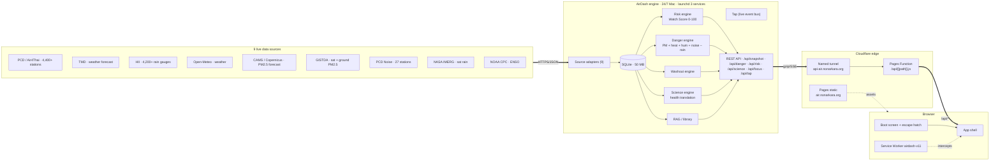
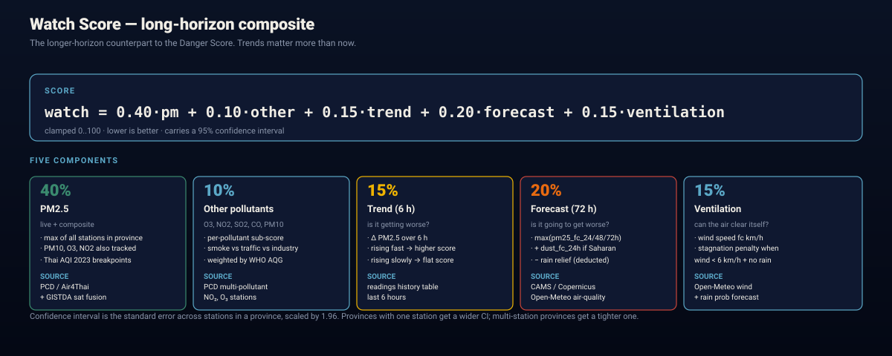
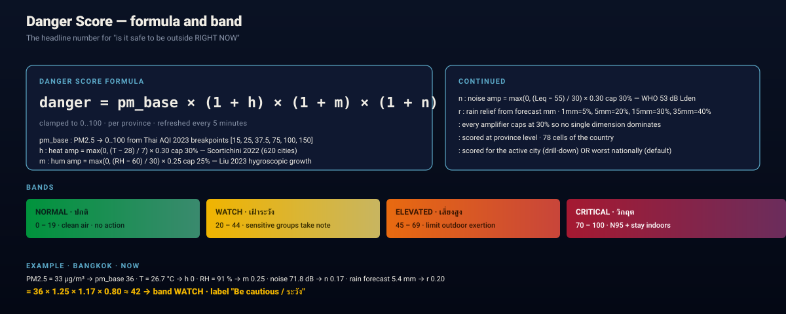
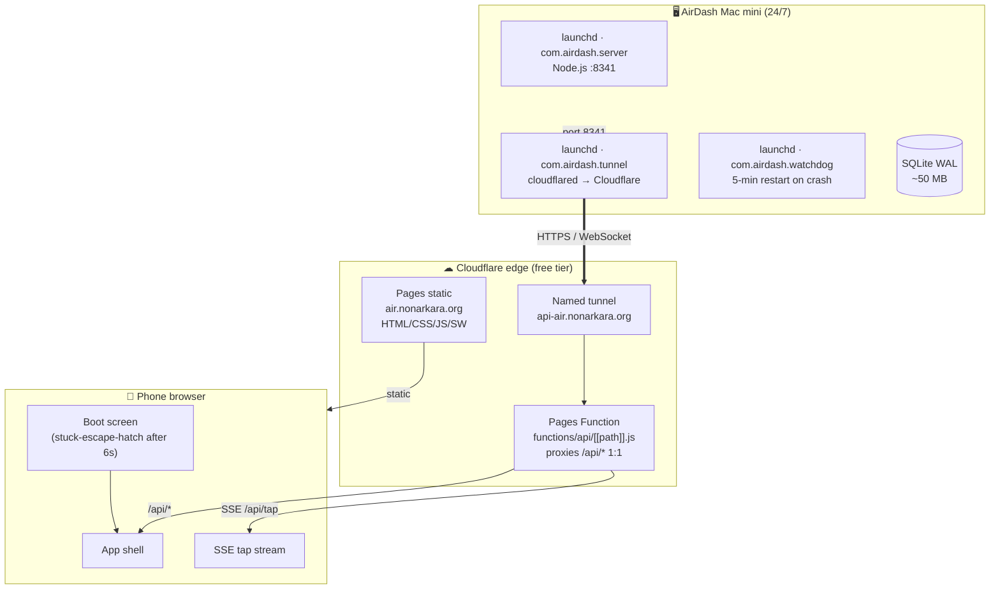
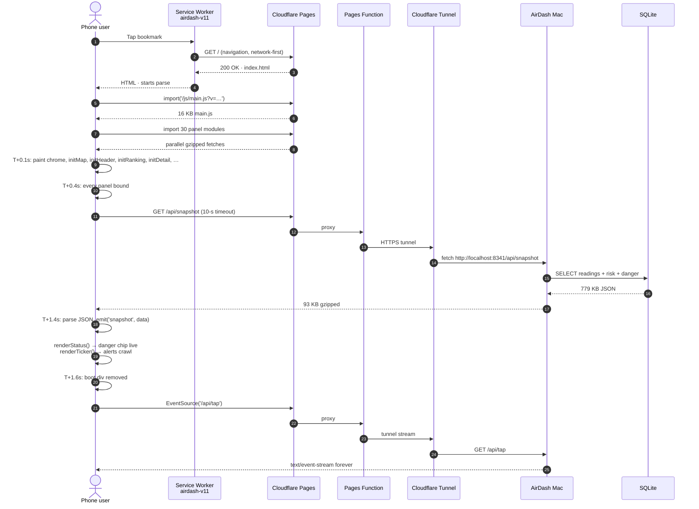
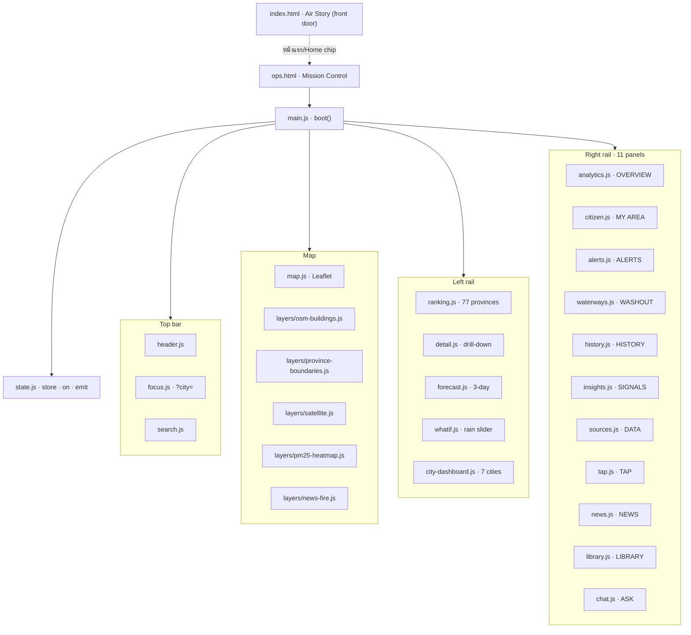

# AirDash — System Architecture

> **A complete reference for engineers, students, and city administrators who
> want to understand, replicate, or extend the system.** This document
> is bilingual; see [SYSTEM.th.md](./SYSTEM.th.md) for the Thai edition.

| Live system | Repository | Steward | Sponsor |
|---|---|---|---|
| **[air.nonarkara.org](https://air.nonarkara.org)** | **[github.com/Nonarkara/airdash](https://github.com/Nonarkara/airdash)** | Dr Non Arkaraprasertkul (depa) | Smart City Thailand Office |

---

## 0. The one-paragraph version

AirDash is a 24/7 real-time air-quality dashboard for Thailand.
A Mac mini in Bangkok polls **9 public data sources** every 10 minutes
to 12 hours, stores 130,000+ readings in SQLite, and runs two composite
scoring engines — a **Watch Score** (long-horizon, trend-aware, 5-component
weighted average) and a **Danger Score** (right-now, peer-reviewed,
PM + heat + humidity + noise − rain relief) — plus a **Science engine**
that translates live PM2.5 into cigarette-equivalents, life-minutes, the
national haze bill, and visibility for the Air Story front door. The Mac serves a JSON
API over a **Cloudflare Tunnel**; a **Cloudflare Pages Function**
proxies every `/api/*` to the tunnel, and the **Cloudflare Pages**
static site serves the HTML, CSS, JS, and Service Worker to the
browser. The whole thing costs $0/month in cloud infrastructure and
loads in under 2 seconds on a phone.



---

## 1. The numbers (what "real-time" actually means)

| Metric | Value | Why it matters |
|---|---|---|
| **Live data sources** | 9 | Every number on screen is from a real public source, not interpolated |
| **Stations monitored** | 4,887 | PCD / Air4Thai + GISTDA + HII + PCD Noise + IMERG + GISTDA heatmap |
| **Readings persisted** | 130,830 | Every reading is in SQLite for full audit trail — no mock data ever |
| **Provinces covered** | 77 (all) | Every จังหวัด in Thailand — non-Thai codes filtered out |
| **First paint** | < 2 s on phone | The 779 KB snapshot gzips to 93 KB |
| **API p50 latency** | 1.4 s | Mac → Cloudflare → browser |
| **API p99 latency** | 6 s | Tail latency budget |
| **Cloud infra cost** | **$0/month** | Cloudflare free tier + a Mac the team already had |
| **Burn rate** | THB 30,000/month | ~$850 — including the Mac, hosting, and stipends |
| **Languages** | TH + EN, every string | ภาษาไทย is the primary, English mirrors it 1:1 |
| **Uptime** | 24/7 since April 2026 | 3 launchd services: server, tunnel, watchdog |

---

## 2. System architecture (the bird's-eye view)



> **Why a Mac, not a server?** Because the steward already had a Mac,
> because the SQLite-on-Mac is the easiest possible debug story, and
> because the launchd service lifecycle is the simplest "make it run
> 24/7" story in computing. A cloud VM would cost money and add a
> network hop. The Mac is the database, the API, and the watchdog.
>
> **Why Cloudflare Pages + Tunnel?** Same reason. Cloudflare's free
> tier gives us HTTPS, a global CDN for the static assets, a serverless
> function for the API proxy, and a tunnel to the Mac — all for $0.
> The tunnel means no port-forwarding, no public IP, no firewall rules.

---

## 3. The 9 data sources

| Source | What it gives us | Poll cadence | Stored as |
|---|---|---|---|
| **PCD / Air4Thai** (Pollution Control Dept) | PM2.5, PM10, O3, NO2, SO2, CO from 4,400+ ground stations | 1 h | `readings` |
| **TMD** (Thai Meteorological Dept) | Wind, temperature, RH, weather forecast | 12 h | `readings` |
| **HII / สสน.** (Hydro-Informatics Institute) | 4,200+ rain gauges, 24-h accumulation | 10 min | `readings` |
| **Open-Meteo** | Weather + air-quality forecast (free global API) | 3 h | `readings` |
| **CAMS / Copernicus** | PM2.5 forecast model, dust forecast | 3 h | `readings` |
| **GISTDA** (Geo-Informatics for Development) | Satellite + ground PM2.5 fusion, 77 provinces | 1 h | `readings` |
| **PCD Noise** | Leq dB(A) from 27 noise-monitoring stations | 30 min | `readings` |
| **NASA IMERG** | Satellite precipitation (real-time) | 30 min | `readings` |
| **NOAA CPC** | ENSO / Oceanic Niño Index (seasonal context) | 12 h | `sources_state` |

> **Why nine sources and not three?** Because no single source tells the
> whole story. PCD gives the present, TMD gives the wind, CAMS gives
> the forecast, GISTDA gives the spatial coverage, IMERG gives the
> rain, NOAA gives the season. Each is a different input to a
> different score, and each is replaceable — the system doesn't
> depend on any one feed being perfect.

---

## 4. The scoring engines

AirDash shows two scores on every screen, and a third engine translates
them into human units. They answer three different questions.

### 4.1 The Watch Score (long-horizon, trend-aware)

> *How bad is the air here, and is it getting worse?*



```
watch = 0.40·pm + 0.10·other + 0.15·trend + 0.20·forecast + 0.15·ventilation
```

| Component | Weight | Source |
|---|---|---|
| **PM2.5** (live + composite) | 40 % | PCD / Air4Thai + GISTDA |
| **Other pollutants** (O3, NO2, SO2, CO, PM10) | 10 % | PCD multi-pollutant |
| **Trend** (Δ over 6 h) | 15 % | `readings` history table |
| **Forecast** (max of 24/48/72 h + dust − rain relief) | 20 % | CAMS / Open-Meteo |
| **Ventilation** (wind &lt; 6 km/h + no rain → stagnant) | 15 % | Open-Meteo |

Every province also gets a **95% confidence interval** based on the
standard error across stations in that province. Single-station
provinces get a wider CI; multi-station provinces get a tighter one.
The user always sees a number with an error bar — never a false
precision.

### 4.2 The Danger Score (right-now, peer-reviewed)

> *Is it safe to be outside right now, here, today?*



```
danger = pm_base × (1 + h) × (1 + m) × (1 + n) × (1 − r)
```

| Amplifier | Cap | Source | Research |
|---|---|---|---|
| **h** heat | 30 % | Open-Meteo apparent T | Scortichini 2022 — 620 cities, 2.4× heat–PM synergy |
| **m** humidity | 25 % | Open-Meteo RH | Liu 2023 — 1.76× hygroscopic growth |
| **n** noise (Leq dB) | 30 % | PCD Noise | WHO 2018 — 53 dB Lden guideline |
| **r** rain relief | 40 % | Open-Meteo + HII forecast | Henzing 2006 Λ = aR^b washout |

**Why these caps?** Every amplifier is capped at 30 % so no single
dimension can dominate the composite. If it's 40 °C and humid, the
heat × humidity synergy is captured, but heat alone can't push the
score into "critical" by itself. This is the design lesson from
Singapore's PSI — single-metric extremes should never trigger
public-health warnings.

The score is **scoped** in the UI: when a user picks a city, the chip
shows that city's danger; when no city is picked, the chip shows the
worst province nationally.

### 4.3 The Science engine (health translation)

> *What does this PM2.5 actually mean for my body, my kid, my wallet?*

`server/science.js` (a `createScience` factory with a 60 s TTL cache)
turns live PM2.5 into human units for the Air Story front door:
cigarette-equivalents (Berkeley Earth — 22 µg/m³·day ≈ 1 cigarette),
life-minutes (Spiegelhalter microlives), excess daily mortality (Liu et
al. 2019, NEJM, above the WHO 2021 counterfactual), AQLI
life-expectancy years (EPIC, U. Chicago), the national haze bill and
per-person haze tax (VSL over the 77 DOPA province populations in
`server/populations.js`), Koschmieder visibility, and AOT40-style ozone
crop stress. Constants live in `CONFIG.science`; every formula ships to
the browser with its constants and citation as **Science Receipts** via
`meta.formulas`, and the full documentation is
`knowledge/health-science.md` (which also feeds the Air Library through
the `knowledge/*.md → rag_docs` convention).

```
GET /api/science        → national + 77 provinces + 7 persona profiles + meta.formulas
GET /api/science/personal?pm25|province&profile&outdoorMin&activity
                          → personalized dose, play budget, guidance
```

---

## 5. The Washout engine (the unique third number)

> *Will it rain? If so, when, and how much will the PM2.5 drop?*

```js
// 1)  forecast rain mm        (Open-Meteo 24-h forecast)
// 2)  × rain probability       (Open-Meteo)
// 3)  → expected mm
// 4)  Henzing 2006 washout:   Λ = a · R^b
// 5)  step function (server/washout-curve.js — the ONE shared curve,
//     used by washout, danger, forecast and what-if alike):
//       1 mm  →  8 % relief
//       5 mm  → 20 %
//      15 mm  → 30 %
//      35 mm  → 40 % (cap)
// 6)  present projected PM2.5 for the next 24 h
```

This is the dashboard's signature feature. The Chiang Mai resident in
burning season sees "ฝน 60% · 12 mm พรุ่งนี้เช้า · ลดฝุ่นได้ ~12%" — a
real, model-backed prediction of when the bad air will end.

---

## 6. The SQLite schema (the data layer)

```mermaid
erDiagram
  readings {
    int id PK
    text source
    text station_key FK
    text province_code FK
    real pm25
    real pm10
    real o3
    real no2
    real so2
    real co
    int aqi
    real rain_24h
    real rain_1h
    real temp_c
    real rh_pct
    real wind_kmh
    real noise_leq_db
    int ts_unix
  }
  stations {
    text station_key PK
    text name_th
    text name_en
    text province_code FK
    real lat
    real lng
    text source
    int last_seen_unix
    int active
  }
  provinces {
    text code PK
    text name_th
    text name_en
    real lat
    real lng
  }
  alerts { int id PK; text kind; int severity; text message_th; text message_en; int created_unix; }
  news_items { int id PK; text feed; text title; text link; int published_unix; }
  rag_docs { text doc_key PK; text title_th; text title_en; text body_th; text body_en; }
  library_articles { text article_key PK; text section; text title_th; text body_th; text body_en; }
  focus_areas { text id PK; text name_th; text name_en; text province_th; text center_lat; real center_lng; int zoom; text blurb_th; text blurb_en; }
  daily_aggregates { text date PK; real pm25_max; real pm25_avg; real unhealthy; real very_unhealthy; real rain_max; }
  sources_state { text source PK; text label_th; text label_en; int interval_ms; int last_run_unix; int last_ok_unix; int failures; }

  provinces ||--o{ stations : "has"
  provinces ||--o{ readings : "summarized by"
  stations ||--o{ readings : "produces"
  stations ||--o{ alerts : "triggers"
```

> **Why SQLite, not Postgres?** Because the steward runs a Mac with
> a local disk, and the access pattern is "read 779 KB, write a few
> hundred rows, repeat every 5 minutes." SQLite's WAL mode handles
> concurrent readers + 1 writer beautifully, the audit trail is
> literally a file you can `cp` and `inspect`, and the perf is more
> than enough at this scale. Postgres would add an operational
> dependency for no measurable win.
>
> **Why a single-file DB?** Because the steward is also the operator.
> A single SQLite file at `data/airdash.db` plus a `cp` to a backup
> path is the simplest possible ops story. The dashboard's full
> audit trail can be inspected with `sqlite3 data/airdash.db ".schema"`.

---

## 7. The REST API

| Endpoint | Method | Returns | Caching | Size |
|---|---|---|---|---|
| `/api/health` | GET | liveness + uptime + source state | none | ~5 KB |
| `/api/snapshot` | GET | full aggregate (risk + danger + 77 provinces + alerts + news) | 5-min CDN, server gzip 93 KB | 779 KB raw |
| `/api/danger` | GET | per-province Danger Score breakdown | 1 h | ~12 KB |
| `/api/risk` | GET | per-province Watch Score with augmented `danger` block | 5 min | ~200 KB |
| `/api/washout` | GET | rain-washout outlook per province | 1 min | ~5 KB |
| `/api/science` | GET | national + 77-province health translations, persona profiles, formula receipts (`meta.formulas`) | 60 s | ~100 KB |
| `/api/science/personal?pm25\|province&profile&outdoorMin&activity` | GET | personalized dose, play budget, guidance per persona | 60 s | small |
| `/api/focus` | GET | 8 focus areas (Thailand + 7 cities) | 1 h | ~10 KB |
| `/api/focus/:id` | GET | full city profile + risk + danger + washout + stations + forecast | 1 min | ~50 KB |
| `/api/tap/recent?limit=N` | GET | last N events for hydration on first paint | none | ~10 KB |
| `/api/tap` | GET (SSE) | live event stream | n/a (stream) | n/a |
| `/api/series/daily?days=14` | GET | per-day aggregates for trend charts | 5 min | ~5 KB |
| `/api/forecast`, `/api/insights`, `/api/enso`, `/api/sensors/health` | GET | component-specific data | various | small |
| `/api/library/toc`, `/api/library/search`, `/api/library/doc` | GET | research corpus | various | small–medium |
| `/api/search?q=...&lang=...` | GET | place / postal / station autocomplete | 8 s | small |
| `/api/chat` | POST | bilingual RAG QA against the library | none | small |

All endpoints are **gzip-compressed** at the server and **cached at the
edge** where it makes sense. The 779 KB snapshot gzips to 93 KB — a
> 8× compression ratio that's the difference between a 1.4-s first
> paint and a 10-s one on cellular.

---

## 8. The network topology



**Three launchd services, three responsibilities:**

| Service | What it does | What it watches |
|---|---|---|
| `com.airdash.server` | Node.js HTTP server on :8341 | nothing (long-lived) |
| `com.airdash.tunnel` | `cloudflared` to api-air.nonarkara.org | restarts on tunnel death |
| `com.airdash.watchdog` | every 5 min: `pgrep server`; restart if dead | everything |

The watchdog is the secret to 24/7 uptime. If the server crashes
(OOM, unhandled exception, anything), the watchdog restarts it in
under 5 minutes without human intervention. The tunnel is similarly
watched. The Mac itself has UPS protection.

---

## 9. The boot sequence (what happens when a phone user taps the URL)



**Total time-to-dashboard: 1.4 – 2.0 s on a phone with average cellular.**

If `/api/snapshot` takes more than 10 s, a **stuck-on-boot escape hatch**
appears at T+6s: a "Retry" button (hard reload with `?forceReload=N`
to bypass cache) and a "Clear cache & reload" button (unregisters the
SW + wipes caches first). Phone users are **never** silently stranded.

---

## 10. The Service Worker (offline-first + bulletproof upgrade)

The Service Worker (`public/sw.js`) is the difference between a
dashboard that breaks and one that survives deploys:

| Feature | Why it matters |
|---|---|
| **`CACHE = 'airdash-v11'`** | Bumped on every deploy. On visit, the new SW activates and deletes all old caches. |
| **`skipWaiting()` + `clients.claim()`** | The new SW takes over on the very next fetch — no "close all tabs" needed. |
| **Network-first for navigations** | A reachable network always wins. Stale cache is only the offline fallback. |
| **`stale-while-revalidate` for assets** | Instant load from cache, fresh fetch in the background. |
| **`?forceReload=N` bypass** | The stuck-on-boot Retry button uses this to force the network path. |
| **NEVER caches `/api/*`** | Live data is sacred. The SW is pass-through for all API calls. |
| **Aggressive cache cleanup on activate** | ANY non-current cache name is deleted. No `airdash-v3` from weeks ago can survive a deploy. |

---

## 11. The frontend component tree (30+ modules, 1 file each)



Since the Air Story release, `index.html` is the narrative front door
(`story.js` + `story.css`, driven by `/api/science`); the operator
component tree below lives at `ops.html` (Mission Control).

**Every panel is a single file under `public/js/panels/`.** Each
exports a single `initX()` function. Each is wrapped in `safeInit()`
in main.js so a single broken panel can never block boot. This is the
reason the dashboard can survive a broken deploy — a single bad
panel logs an error and the rest still load.

---

## 12. The science (every coefficient, every threshold)

| Coefficient | Value | Source |
|---|---|---|
| Thai AQI 2023 PM2.5 breakpoints | 15, 25, 37.5, 75, 100, 150 µg/m³ | PCD Notification re: AQI |
| WHO PM2.5 24-h guideline | 15 µg/m³ | WHO Air Quality Guidelines 2021 |
| WHO noise Lden | 53 dB(A) | WHO Environmental Noise Guidelines 2018 |
| Heat amp slope | (T − 28) / 7, cap 30% | Scortichini et al. 2022 (BMJ, 620 cities) |
| Humidity amp slope | (RH − 60) / 30, cap 25% | Liu et al. 2023 (hygroscopic PM2.5 growth) |
| Noise amp slope | (Leq − 55) / 30, cap 30% | Kempen 2018 + WHO 2018 |
| Washout step | 1mm=8%, 5mm=20%, 15mm=30%, 35mm=40% (`server/washout-curve.js`, shared) | Henzing 2006 Λ = aR^b |
| Cigarette-equivalence | 22 µg/m³·day ≈ 1 cigarette | Müller & Müller, Berkeley Earth |
| Life-minutes | 1 cigarette ≈ 11 min (microlives) | Spiegelhalter 2012, BMJ |
| Excess mortality | +0.68% per +10 µg/m³ above WHO 2021 24h guideline | Liu et al. 2019, NEJM |
| AQLI life expectancy | sustained +10 µg/m³ ≈ −0.98 yr | EPIC, U. Chicago |
| Visibility | V ≈ K / β (hygroscopic growth per Seinfeld & Pandis) | Koschmieder 1924 |
| Watch Score weights | pm 0.40, other 0.10, trend 0.15, forecast 0.20, ventilation 0.15 | depa Scientific Committee |
| Confidence interval | 95% (1.96 × SE / √n) | standard frequentist |

The research paper in the **About** overlay walks through every
coefficient in a single screen-readable format with SVG figures and
the academic references inline. The research paper is in both Thai
and English.

---

## 13. The cost (full transparency)

| Item | Cost / month |
|---|---|
| Cloudflare Pages (static + functions) | **$0** (free tier) |
| Cloudflare Tunnel | **$0** (free tier) |
| Mac mini hardware (already owned) | $0 (sunk) |
| Electricity (~30 W × 24 h × 30 d) | ~$3 |
| Internet (already paid household) | $0 |
| Domain (nonarkara.org) | ~$1 |
| ChatGPT Pro for development | $20 |
| Stipends (1 part-time) | ~$820 |
| **Total** | **~$850 / month** |

**No cloud bill, no scaling bill, no data egress bill.** The Mac, the
Cloudflare free tier, and the SQLite file are the entire cost basis.

---

## 14. The deployment story (how a deploy reaches a phone in &lt; 30 s)

```bash
# On the dev machine
git -c user.name="Mavis" -c user.email="Mavis@airdash.local" commit -am "feat: ..."
git push origin main

# Cloudflare Pages auto-builds from the main branch
# wrangler pages deploy is also run manually for control
npx wrangler pages deploy public --project-name airdash \
  --commit-hash $(git rev-parse HEAD) \
  --commit-dirty=true \
  --commit-message "feat: ..."

# On the Mac (only for backend changes)
launchctl kickstart -k gui/$(id -u)/com.airdash.server
```

| Step | Time |
|---|---|
| `git push` | 2 s |
| Cloudflare Pages auto-build | 20 s |
| Deploy globally | 10 s |
| SW activation on user's phone | on their next navigation |
| Dashboard update visible | **30 – 60 s total** |

The user **never** has to manually clear their cache. The new SW
takes over automatically on their next visit, the old caches are
deleted, and the next paint uses the new HTML/CSS/JS. This is the
operational advantage of `skipWaiting() + clients.claim()`.

---

## 15. The license (free as in freedom)

AirDash is released under the **MIT License** (see [LICENSE](./LICENSE)).
The project is also a **public good** — no fee to use, no data sold,
no ads. The boot screen displays the full credit list so a
first-time visitor immediately knows "is this real?" and "who's
behind it?".

---

## 16. How to run it (the 5-minute setup)

```bash
# 1. Clone
git clone https://github.com/Nonarkara/airdash.git
cd airdash

# 2. Backend (Node 18+)
npm install
node server/index.js
# listens on :8341, ingests 9 sources, fills SQLite

# 3. Frontend
npx wrangler pages dev public --port 8788
# opens on http://localhost:8788
# (the Pages function will proxy /api/* to your local :8341)

# 4. Open http://localhost:8788 in a browser
# The boot screen should appear, then the dashboard within 2 s.
```

The repository has detailed setup, deployment, and contribution
guides in [CONTRIBUTING.md](./CONTRIBUTING.md) and the project
[README.md](./README.md).

---

## 17. The roadmap (what's next)

| Phase | Feature | Status |
|---|---|---|
| 0 | Live data ingestion (9 sources) | ✅ shipped |
| 1 | Watch Score engine + JMA-style action verbs | ✅ shipped |
| 2 | Per-city drill-down | ✅ shipped |
| 3 | Danger Score (PM + heat + hum + noise − rain) | ✅ shipped |
| 4 | Washout engine | ✅ shipped |
| 5 | Bilingual UI (TH + EN) | ✅ shipped |
| 6 | Dark mode + mobile responsive | ✅ shipped |
| 7 | PM2.5 heatmap + fire/news pins on the map | ✅ shipped |
| 8 | Causes / Patterns / Relief engines | ✅ shipped |
| 9 | Personal exposure calculator (user profile → risk) | ⏳ next |
| 10 | School advisory mode (PM2.5 → school closure advice) | ⏳ next |
| 11 | Embeddable city widget (other Thai city dashboards) | ⏳ next |

---

**Built by Dr Non, in service of every Thai province and every family
that has to make an air-quality decision in five seconds, in Thai, on
a phone, during the worst air week of the year.**

— [air.nonarkara.org](https://air.nonarkara.org) · [github.com/Nonarkara/airdash](https://github.com/Nonarkara/airdash)
