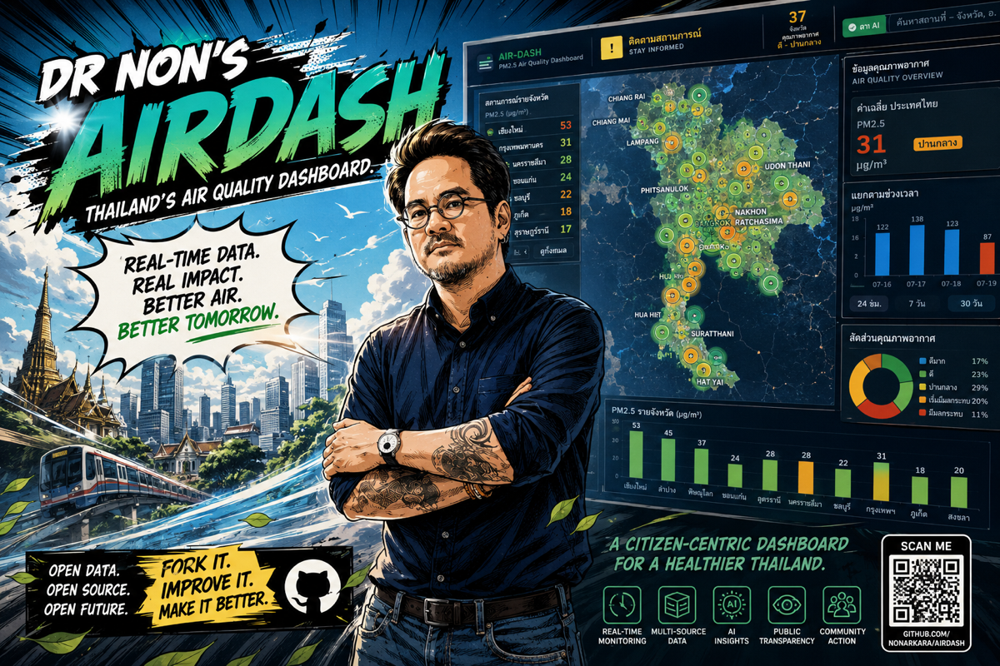

<p align="center">
  
</p>

# AIRDASH 2.0

## เฝ้าระวังฝุ่น PM2.5 และคุณภาพอากาศประเทศไทย · Thailand Air Quality & Dust Watch

> **Real-time data. Real impact. Better air. Better tomorrow.**
> An operating system for air-quality decision making — with two front
> doors. **Air Story** (`/`) is a scroll-based bilingual narrative for
> smart kids and curious adults: a breathing hero tinted by the live Thai
> AQI band, your day in cigarette-equivalents, the national haze bill,
> and every formula with its receipt. **Mission Control** (`/ops.html`)
> is the preserved operator dashboard for mayors, district officials,
> researchers, journalists, and air detectives. Every figure is real-time
> from Thai government sources, every number carries a confidence
> interval, and the first thing on screen is always the action the user
> should take.

<p align="center">
  <strong>🇹🇭 Live:</strong> <a href="https://air.nonarkara.org">air.nonarkara.org</a> ·
  <strong>🔀 Fork it:</strong> <a href="https://github.com/Nonarkara/airdash/fork">github.com/Nonarkara/airdash</a> ·
  <strong>📐 System architecture:</strong> <a href="ARCHITECTURE.md">ARCHITECTURE.md</a> ·
  <strong>🇹🇭 ฉบับภาษาไทย:</strong> <a href="README.th.md">README.th.md</a>
</p>

<p align="center">
  
  
  
  
  
  
</p>

---

## 🎯 The Mission

Every dust season, ordinary people make decisions that determine what their
families breathe. Most of those people are not atmospheric scientists. Most
have never read a µg/m³ chart. They live in Chiang Mai, in Khon Kaen, in
the Bangkok suburbs — and the dashboard that tells them what to do has to
work in five seconds, in Thai, on a phone, during the worst air week of
the year.

**The thesis behind every design decision:**

> *"Data is not a decision. A number on a screen is not an action. AirDash
> exists to close the gap between 'we know the air is bad' and 'we know
> what to do about it.'"*

This is what every JMA-style action verb, every confidence interval, every
hotline button, every nearest-station card, and every washout figure serves.

---

## 🚪 Two Experiences, One Engine

### 📖 Air Story — the front door (`/`)

A scroll-based bilingual narrative, not a dashboard — built for smart
kids and curious adults. One question per chapter:

* **The hero** — a full-viewport breathing circle tinted by the live
  Thai AQI band, carrying the number everyone understands: today's
  national PM2.5 in **cigarette-equivalents** (22 µg/m³·day ≈ 1
  cigarette, the Berkeley Earth rule).
* **The persona picker** — kid / teen / adult / athlete / senior /
  pregnant / asthma (kid first — parents look for their kids). Each
  persona gets a personalized dose, play budget, and guidance from
  `GET /api/science/personal`.
* **The body** — a body-journey SVG of where the particles go.
* **The Wallet** — the daily national haze bill (value of statistical
  life), your per-person "haze tax", and three freakonomics cards: the
  externality of field burning, the information asymmetry of invisible
  PM2.5, and present bias.
* **The Sky** — a Koschmieder visibility estimate, a stagnation
  explainer, and cause chips.
* **The Forest** — AOT40-style ozone crop stress.
* **Science Receipts** — every formula on the wall with its constants
  and citation, rendered live from `/api/science` `meta.formulas`.
* **ACT** — a band-aware checklist, alert signup (LINE OA / LINE
  Notify / Telegram), and the bridge to Mission Control.

### 🛰️ Mission Control — the operator dashboard (`/ops.html`)

The original dashboard, preserved in full: header + ranking rail +
Leaflet map + 11-tab right rail + ticker, re-paletted to the AirDash
tokens. For mayors, district officials, researchers, journalists — and
every air detective who wants the raw truth. A "หน้าแรก/Home" chip
takes you back to Air Story.

---

## 🏛️ Project Of

**Dr Non Arkaraprasertkul** — Senior Expert, Smart City Promotion Department,
**Digital Economy Promotion Agency (depa)**, Kingdom of Thailand.

Produced under the **Smart City Thailand Office** (สำนักงานเมืองอัจฉริยะประเทศไทย),
Ministry of Digital Economy and Society.

**ดร.นน อัครประเสริฐกุล** — ผู้เชี่ยวชาญอาวุโส ฝ่ายส่งเสริมเมืองอัจฉริยะ
สำนักงานส่งเสริมเศรษฐกิจดิจิทัล (depa) ภายใต้สำนักงานเมืองอัจฉริยะประเทศไทย

---

## 🤝 Sponsors, Partners & Data Sources

The dashboard is a public-interest system. No fee to use, no data sold, no
ads. Everything ships from real Thai government and open scientific sources.
The boot screen displays the full credit list so a first-time visitor
immediately knows "is this real?" and "who's behind it?".

### Steward

* **depa** — Digital Economy Promotion Agency (สำนักงานส่งเสริมเศรษฐกิจดิจิทัล)
  — the agency under whom the project lives

### Partners

* **Smart City Thailand Office** (สำนักงานเมืองอัจฉริยะประเทศไทย)
* **Axiom + ReTL** — *The Reason To Live Company* (engineering partner)

### Standards bodies

* **SLIC** — Smart Living Industry Cluster
* **RCAD** — Research and Innovation Acceleration Agency

### Data providers (the public-interest feed)

* **PCD** (คพ.) — Pollution Control Department · Air4Thai network
* **TMD** (อุตุฯ) — Thai Meteorological Department
* **HII / สสน.** — Hydro-Informatics Institute · rain gauges

### External reference data (free / open)

* **Open-Meteo** — weather + CAMS air-quality forecast delivery
* **Copernicus / CAMS** — PM2.5 forecast model
* **NOAA CPC** — ENSO / Oceanic Niño Index
* **NASA GIBS / GPM** — satellite imagery + IMERG precipitation
* **RainViewer** — radar tile mosaic
* **JAXA** — satellite precipitation products

---

## 🌬️ What AirDash Does

**For the Chiang Mai resident in burning season:** opens the page, sees
"PROTECT NOW" in red at the top, reads the one-line reason, checks the
washout panel — 60% chance of 12 mm rain tomorrow, expected relief ~12% —
finds the 3 nearest AQ stations, shares the status with family on LINE,
and taps 1650 to reach PCD. Total time: under a minute.

**For the Bangkok commuter:** checks the 48-hour PM2.5 forecast strip for
the week's worst mornings, sees the confidence interval, and decides
whether tomorrow is a mask day or a work-from-home day.

**For the district official:** opens the dashboard on the wall TV, sees
the JMA-style national action card with a checklist of what to do this
hour, and the WHAT-IF slider to ask "if 20 mm of rain falls tonight, what
does my province's PM2.5 project to?".

**For the news reporter:** grabs a confidence-bounded number ("province X
is at 60/100 ±5") and a screenshot of the citizen panel to embed in the
story, with a direct link to the live data behind it.

**For the researcher:** downloads the full historical dataset as CSV,
follows the methodology in the in-app Air Library, and reproduces every
number from the bilingual research paper.

---

## 🧭 The Action Framework

The single most important design choice in the system: **no one is shown a
passive label**. Every band ships with exactly one verb, in both Thai and
English, sized to dominate the page. Pattern-match in under 500 ms
(Klein's recognition-primed decision model).

| Band | Score | Thai verb | English verb | Color |
|------|------:|-----------|--------------|-------|
| `normal` | 0–19 | **อากาศดี** | **GOOD AIR** | 🟢 Green |
| `watch` | 20–44 | **ติดตามสถานการณ์** | **STAY INFORMED** | 🟡 Yellow |
| `elevated` | 45–69 | **ลดกิจกรรมกลางแจ้ง** | **LIMIT OUTDOOR TIME** | 🟠 Orange |
| `high` | 70+ | **ป้องกันทันที** | **PROTECT NOW** | 🔴 Brick red |

AirDash deliberately does **not** issue health orders from its heuristic
score. Health measures are shown as conditional guidance tied to official
PCD / Department of Health advisories.

**The "dust season override":** even when the score says "NORMAL", during
the dust-season window (1 December – 30 April) with the national dust load
elevated, the hero reads "LOW · STAY INFORMED" so the citizen never assumes
the season is over.

**Dust-season trigger:** the override fires when at least 30% of sampled
provinces have a worst PM2.5 of 25 µg/m³ or more AND the date falls within
the season window. The dashboard is honest about the trigger in the hero
subtitle.

---

## 👥 Two Ways to Use the Dashboard

*These two modes live in Mission Control (`/ops.html`) — Air Story (`/`)
needs no mode switch, because it is the citizen experience.*

### 🟢 Citizen mode (ง่าย / EASY)

For non-technical readers. Auto-selected on first visit with a `?city=X`
link (e.g. `https://air.nonarkara.org/?city=Chiang%20Mai`).

Shows: **just the essentials.**
* JMA verb at the top (one tap to read aloud)
* 1650 / 1422 / 1669 hotline buttons
* My province's air + 3 nearest AQ stations + share buttons
* Per-band health checklist (N95, windows, clean room, sensitive groups)
* LINE push opt-in
* The map

Hides: forecast strip, what-if widget, pipeline health, signal details,
insights panel, library, history — anything that needs context to read.

### 🟦 Operator mode (เต็ม / FULL)

For mayors, district officials, researchers, journalists. Default mode.

Shows: **everything.** The full right-rail: analytics, washout, live tap,
sources, signals, history, library, alerts, news, chat, citizen.

Toggle at the top-right of the header. The choice persists in
`localStorage`.

---

## 📊 Seven Data Pipelines, One Truth

AirDash unifies **seven** open public data pipelines into a single bilingual
dashboard with a real-time "tap" of every pipeline event:

| # | Source | Agency | Cadence | Coverage |
|---|--------|--------|---------|----------|
| 1 | Ground AQI network (PM2.5/PM10/O3/NO2/SO2/CO) | PCD Air4Thai (คพ.) | 1 hour | ~200 stations — PRIMARY |
| 2 | Weather forecast (rain amount/probability, wind) | Open-Meteo | 3 hours | 77 province centroids |
| 3 | Air-quality forecast (PM2.5 to 72 h) | Copernicus CAMS via Open-Meteo | 3 hours | 77 provinces |
| 4 | Rain gauges (observed washout verification) | Multi-agency via HII (สสน.) | 10 min | ~4,200 gauges |
| 5 | Satellite precipitation | NASA GPM IMERG | 30 min | token-gated, skips quietly |
| 6 | ENSO / Oceanic Niño Index | NOAA CPC | 12 hours | Seasonal modulator |
| 7 | Air-quality news | Google News TH + Khaosod | 30 min | Keyword-filtered headlines |

**Map layers** (rendered client-side, not stored): RainViewer radar
animation, NASA GIBS satellite imagery, JAXA precipitation, and the
province-boundaries choropleth.

---

## 🧮 The Air Watch Score

**Province Air Watch Score** — `score = 0.40·pm25 + 0.10·pollutants + 0.15·trend + 0.20·forecast + 0.15·stagnation`

| Band | Score | Color | Meaning |
|------|-------|-------|---------|
| NORMAL | 0–19 | 🟢 Green | Good air · live normally |
| WATCH | 20–44 | 🟡 Yellow | Stay informed |
| ELEVATED | 45–69 | 🟠 Orange | Limit outdoor time · signals aligning |
| CRITICAL | 70+ | 🔴 Brick red | Protect now · follow official advisories |

The PM2.5 sub-score is anchored to the **Thai AQI 2023 breakpoints
(15 / 25 / 37.5 / 75 µg/m³)**; trend reads the 6-hour rise; forecast folds
in CAMS; stagnation reads forecast wind + rain probability as a
ventilation proxy.

> **This is a heuristic indicator, not an air-quality forecast.** The UI
> and the AI assistant both say so, repeatedly. Always follow official
> PCD / TMD / DOH advisories.

### Confidence intervals

Every number that changes ships with a confidence interval — the hero shows
"60/100 ±5" instead of just "60". The CI is derived from:
* data freshness (how stale is the latest reading?)
* sensor coverage (how many stations back the score?)
* score stability (how much has the score moved in the last 6 hours?)

A number without a confidence interval is a guess. A number with a
confidence interval is a measurement.

---

## 🌧️ Rain-Washout · The signature feature

Wet deposition: rain scavenges airborne particles, so **a forecast rain
event is a forecast dust-relief event**. For every province, AirDash
combines what the air holds now (worst fresh PM2.5), how likely rain is,
and how much is forecast:

* `relief_if_rain_pct` — expected PM2.5 reduction IF the forecast rain falls
  (1–5 mm ≈ 8% · 5–15 mm ≈ 20% · 15–35 mm ≈ 30% · ≥35 mm ≈ 40%)
* `expected_relief_pct` — probability-weighted relief (the honest number)
* `projected_pm25` — the after-rain level if it does rain
* band — `strong` / `moderate` / `light` / `none` (amount AND probability
  must both clear the bar)

One shared relief curve (`server/washout-curve.js`) feeds the washout,
danger, forecast, and what-if engines, so the numbers always agree.

The WASHOUT panel ranks provinces by who gets helped most; the WHAT-IF
slider asks "if X mm falls in 24 h, what does each province project to?";
and ~4,200 HII rain gauges verify whether a promised washout actually
arrived. Derived from published washout ratios — a heuristic, not
dispersion modelling, and labelled as such everywhere it appears.

```
GET /api/washout
GET /api/whatif?rain=20
```

---

## 🔬 The Science Engine

The layer that turns µg/m³ into meaning. `server/science.js` (a
`createScience` factory with a 60 s TTL cache) computes national and
per-province health translations from live PM2.5, 77-province DOPA
populations (`server/populations.js`), and constants in
`CONFIG.science`:

| Translation | Formula | Citation |
|---|---|---|
| Cigarette-equivalents | PM2.5 ÷ 22 | Müller & Müller, Berkeley Earth |
| Life-minutes lost | cigs × 11 min | Spiegelhalter microlives (BMJ 2012) |
| Excess daily mortality | +0.68% per +10 µg/m³ above the WHO 2021 24 h guideline | Liu et al. 2019 (NEJM, 652 cities); Burnett et al. 2018 (GEMM) |
| Life expectancy lost | sustained +10 µg/m³ ≈ −0.98 yr | AQLI / EPIC, U. Chicago |
| National haze bill + "haze tax" | VSL × attributable deaths ÷ population | value-of-statistical-life economics |
| Visibility | V ≈ K / β | Koschmieder 1924 |
| Ozone crop stress | AOT40-style weekly ppb·h | WHO 2021 |

Every constant, formula, and citation ships to the browser as **Science
Receipts** via `meta.formulas`, and the full documentation lives in
[`knowledge/health-science.md`](knowledge/health-science.md) — which
also feeds the in-app Air Library through the `knowledge/*.md →
rag_docs` convention. On a typical good-air day the national readout is
roughly: PM2.5 ~18 µg/m³ → ~0.8 cigarettes/day, ~9 life-minutes/day, a
฿50M-class daily national bill, under ฿1/person haze tax, ~23 km
visibility, AOT40 ~34 ppb·h (low).

```
GET /api/science        # national + 77 provinces + persona profiles + formula receipts
GET /api/science/personal?province=50&profile=kid&outdoorMin=90&activity=moderate
```

---

## 💬 Ask-AI · The "moat" feature

The chat answers questions about the air situation using **only** the live
data the system holds — no web search, no hallucination, no historical
training. If the model is offline, it gracefully degrades to a structured
live-data summary.

The chat lives in Mission Control in two places:
1. **The right-rail ASK tab** — full chat with history and feedback
2. **The Air Library** — natural-language Q&A against the background
   methodology chapters (now including the health-science receipts)

Example questions a citizen can ask:
* "จังหวัดไหนฝุ่นแย่สุดตอนนี้" — "Which province has the worst dust right now?"
* "ฝนจะช่วยลดฝุ่นที่เชียงใหม่ไหม" — "Will rain help the dust in Chiang Mai?"
* "พรุ่งนี้ PM2.5 กรุงเทพเป็นอย่างไร" — "What's Bangkok's PM2.5 outlook tomorrow?"
* "อธิบายวิธีคำนวณคะแนนเฝ้าระวัง" — "Explain how the watch score is calculated"

---

## 📲 Alerts — LINE & Telegram

Citizens can subscribe to AirDash alerts through three channels: the
**LINE Official Account**, **LINE Notify**, and the **Telegram bot**.
Severe system alerts can be broadcast through the LINE Messaging API
when the operator configures the channel token; Telegram broadcasts use
the bot token. AirDash never asks a citizen to paste a messaging token
into the dashboard. Sign-up links live in the ACT chapter of Air Story
and in Mission Control's citizen panel.

---

## 🔀 Compare Places

Click `⊟` in the header to open the **Compare Places** overlay — up
to **4 mini maps side-by-side**, each with a search bar that finds any
of **70k+ places** (provinces, districts, tambons, stations) by Thai
name, English name, or 5-digit postal code.

The data bar on the left shows a compact card per selected place: its JMA
verb, score with confidence interval, worst PM2.5 + station count, washout
band, forecast 48 h, and 6 h trend. Color-coded by band so a glance tells
you who is dustiest.

```
Use case 1: Basin vs plain
  · Open compare, pick 2 panes
  · Type "เชียงใหม่" then "กรุงเทพ" — the burning-season gap becomes legible

Use case 2: Northern comparison
  · Open compare, switch to 4 panes
  · Type "เชียงใหม่", "เชียงราย", "แม่ฮ่องสอน", "ลำปาง"
  · The data bar shows four verbs and washout bands at a glance

Use case 3: Postal-code deep link
  · Type "50200" — finds the tambon served by that zip
  · The map flies to the tambon's lat/lng
```

---

## 📊 Research Paper

The full bilingual research paper — methodology, data sources, indicator
derivation, washout model, retention policy, and honest limitations — is
available in two places:

1. **In-app:** Click the `ⓘ About` button → `Research Paper` tab (includes
   infographics, data dictionary, and CSV dataset download)
2. **Markdown:** [`knowledge/paper.md`](knowledge/paper.md)

**Dataset download:** The `GET /api/export/full` endpoint streams every
permanent hourly aggregate as CSV.

---

## 💻 Technical Stack

* **Backend:** Single Node.js process, zero npm dependencies (Node ≥ 22.5
  built-ins only: `fetch`, `node:http`, `node:sqlite`)
* **Database:** SQLite in WAL mode — a single file you can back up by copying
* **Frontend:** Vanilla ES modules, vendored Leaflet, no build step
* **AI Chat:** Cloud-routed; gracefully degrades to structured live-data
  summary when offline
* **Push:** LINE Official Account + LINE Notify + Telegram bot broadcasts
* **Deployment:** Cloudflare Pages (frontend) + Cloudflare Tunnel (backend)

---

## 🎨 Design Language

**"Rams × NYC transit × Thai command" — reborn in sky and teal.**

Light sky-paper ground (`#F4F8FB`), deep-teal ink (`#0E4A5E`), sage
(`#3A8A6E`), ochre (`#D8893A`), brick (`#C8453A`), and purple
(`#6B2D5C`) — with the Thai-AQI 5-band palette for severity. Sarabun
for Thai and UI, Manrope for display, JetBrains Mono for every number
that changes. Sharp corners. No shadows. Full automatic dark mode, and
`prefers-reduced-motion` stills the breathing hero.

Brick red appears **only** when the air is genuinely hazardous — it is
never decorative.

---

## ♿ Accessibility (a11y)

* **WAI-ARIA Tabs pattern** with full keyboard navigation
* `role="status"` + `aria-live="polite"` on the boot screen
* Separate `aria-live` region announces "Dashboard ready · current
  situation: <JMA verb>" when boot goes away
* `aria-label` on the citizen pin, station cards, share buttons
* Color is never the only signal — every band has a verb and an icon
* Focus-visible outlines on every interactive element
* Thai font set to 11px minimum; numbers always in JetBrains Mono
* Hotlines are `tel:` links — one-tap dial on mobile

---

## 📡 API Endpoints

| Endpoint | Description |
|----------|-------------|
| `GET /api/snapshot` | Current live data (risk, air, rain, forecasts, alerts, news) |
| `GET /api/risk` | Province Air Watch Scores (with CI, verdict cards, washout join) |
| `GET /api/washout` | **Rain-Washout per province** — chance of rain, expected relief, projected PM2.5 |
| `GET /api/wetness` | Back-compat alias → washout payload |
| `GET /api/whatif?rain=X` | "If X mm falls in 24 h" — projected PM2.5 per province |
| `GET /api/science` | National + 77-province health translations, persona profiles, formula receipts (`meta.formulas`) |
| `GET /api/science/personal?pm25\|province&profile&outdoorMin&activity` | Personalized dose, play budget, and guidance per persona |
| `GET /api/forecast` | Score projections at +24/+48/+72 h (CAMS + washout relief) |
| `GET /api/enso` | ENSO / ONI ocean state |
| `GET /api/series?source&station&metric&hours` | Time series for one station |
| `GET /api/stations?q=…` | Station search |
| `GET /api/stations/nearest?lat&lng&limit` | N nearest AQ stations with latest PM2.5/AQI |
| `GET /api/alerts` | Threshold-crossing alerts |
| `GET /api/news` | Air-quality news headlines |
| `GET /api/tap` | Live event stream (SSE) |
| `GET /api/sensors/health` | Per-station liveness |
| `GET /api/sensors/dead.csv` | CSV of dead / stuck / abnormal sensors |
| `POST /api/chat` | AI chat (streams; falls back to data summary) |
| `GET /api/library/toc?lang=th\|en` | Air Library table of contents |
| `GET /api/insights` | Real-time signals (sensor health + thresholds) |
| `GET /api/export/full` | **Full dataset CSV** (all permanent hourly aggregates) |
| `GET /api/export/daily?date=YYYY-MM-DD` | One-day export (JSON or CSV) |
| `GET /api/sources` | Data-source catalog |
| `GET /api/health` | Service + DB + pipeline status |

---

## 🆘 Always Follow Official Warnings

AirDash is a **decision-prioritisation system**, not an alert issuer.

* **PCD pollution hotline 1650**
* **DDC health hotline 1422**
* **EMS 1669**
* **PCD portal** at [pcd.go.th](https://www.pcd.go.th)
* **Official AQI** at [air4thai.pcd.go.th](https://air4thai.pcd.go.th)

If the dashboard is wrong, follow the official channel. If the dashboard
is right, share it.

---

## 📜 License & Attribution

© 2026 Dr Non Arkaraprasertkul. All rights reserved.

Data sourced from each respective Thai government agency and open provider
(PCD, TMD, HII, NOAA, Copernicus/CAMS, Open-Meteo, RainViewer, NASA
GIBS/GPM, JAXA). Produced under the Digital Economy Promotion Agency (depa)
and the Smart City Thailand Office.

**Always follow official PCD / TMD / DOH advisories.** This system is for
prioritisation, not for issuing alerts.

---

## 📧 Contact

**Dr Non Arkaraprasertkul**
`non.ar@depa.or.th`
[smartcitythailand.or.th](https://smartcitythailand.or.th)
[nonarkara.org](https://nonarkara.org)
