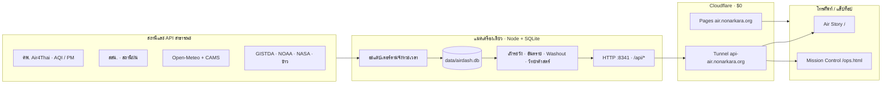

<p align="center">
  
</p>

# AIRDASH 3.0

## เฝ้าระวังฝุ่น PM2.5 และคุณภาพอากาศประเทศไทย · Thailand Air Quality & Dust Watch

**ระบบสาธารณะบนแมคเครื่องเดียว:** สองภาษาไทย/อังกฤษ ซื่อสัตย์เรื่องแหล่งข้อมูล
ใช้ได้จริงในห้าวินาทีบนโทรศัพท์ แบนเนอร์มังงะด้านบนเป็นภาพประกอบ
ไม่ใช่คำอ้างว่าซอฟต์แวร์เอาชนะหมอกควันได้

> ระบบปฏิบัติการสำหรับการตัดสินใจเรื่องคุณภาพอากาศ — มีสองประตูหน้า
> **Air Story** (`/`) คือหน้าแรกแบบเล่าเรื่องสองภาษาไล่ตามการเลื่อนจอ
> สำหรับเด็กฉลาดและผู้ใหญ่ที่อยากรู้: วงกลม hero ที่หายใจตามสีของแถบ
> Thai AQI สด ๆ ฝุ่นวันนี้เทียบเท่าบุหรี่กี่มวน ค่าหมอกควันทั้งประเทศต่อวัน
> และทุกสูตรมีใบเสร็จวิทยาศาสตร์กำกับ **Mission Control** (`/ops.html`)
> คือแดชบอร์ดผู้ปฏิบัติการตัวเต็มที่ถูกเก็บไว้ครบถ้วน สำหรับนายกเทศมนตรี
> เจ้าหน้าที่อำเภอ นักวิจัย นักข่าว และนักสืบเรื่องอากาศ
> ทุกตัวเลขมาจากแหล่งข้อมูลภาครัฐไทยและแหล่งวิทยาศาสตร์เปิดแบบเรียลไทม์
> ทุกตัวเลขมี confidence interval และสิ่งแรกที่ผู้ใช้เห็นคือการกระทำที่ควรทำ

<p align="center">
  <strong>🇹🇭 ใช้งานจริง:</strong> <a href="https://air.nonarkara.org">air.nonarkara.org</a> ·
  <strong>🔀 Fork:</strong> <a href="https://github.com/Nonarkara/airdash/fork">github.com/Nonarkara/airdash</a> ·
  <strong>📐 สถาปัตยกรรม:</strong> <a href="ARCHITECTURE.md">ARCHITECTURE.md</a> /
  <a href="SYSTEM.th.md">SYSTEM.th.md</a> ·
  <strong>🇬🇧 English version:</strong> <a href="README.md">README.md</a>
</p>

<p align="center">
  
  
  
  
  
  
</p>

---

## สารบัญ

1. [นี่คืออะไร](#นี่คืออะไร)
2. [ปรัชญา](#ปรัชญา)
3. [การใช้ตามจริยธรรม](#การใช้ตามจริยธรรม)
4. [ระบบทำงานอย่างไร](#ระบบทำงานอย่างไร)
5. [เว็บสด](#เว็บสด)
6. [วิธีรัน](#วิธีรัน)
7. [ส่วนที่เหลือของระบบ](#ภารกิจ) (ภารกิจ พื้นผิว แหล่งข้อมูล คะแนน API)
8. [สัญญาอนุญาต](#license)

---

## นี่คืออะไร

AirDash คือ **ระบบเฝ้าระวัง PM2.5 / คุณภาพอากาศเพื่อสาธารณประโยชน์ของประเทศไทย**
ไม่แทนที่กรมควบคุมมลพิษ (คพ.) Air4Thai กรมอุตุนิยมวิทยา หรือกรมอนามัย
แต่นั่งบนตัวเลขที่หน่วยงานเหล่านั้นและแหล่งวิทยาศาสตร์เปิดเผยอยู่แล้ว
แล้วพยายามตอบคำถามเชิงปฏิบัติข้อเดียว:

> วันนี้ลูกออกไปเล่นข้างนอกได้ไหม — ถ้าไม่ได้ ต้องทำอะไรในห้านาทีข้างหน้า?

เป็นพี่น้องของ [FloodDash](https://flood.nonarkara.org): แมคเครื่องเดียว
SQLite สองภาษา ค่าคลาวด์ $0 น้ำท่วมมาเป็น “เหตุการณ์” อากาศแย่มาเป็น
**ฤดูกาล** (ประมาณ 1 ธันวาคม – 30 เมษายน) ส่วนที่เพิ่มเป็นลายเซ็นของอากาศคือ
**Rain-Washout** — ฝนคือการบรรเทาตามธรรมชาติที่เร็วที่สุดของฝุ่น
จึงถือว่าพยากรณ์ฝนเป็นการพยากรณ์ *การบรรเทา* ด้วย และติดป้ายว่าเป็น heuristic
ไม่ใช่คำสัญญา

สองพื้นผิว เครื่องยนต์เดียว:

| พื้นผิว | URL | สำหรับใคร |
|---------|-----|-----------|
| **Air Story** | [`/`](https://air.nonarkara.org/) | ครอบครัว นักเรียน คนที่ต้องการคำกริยาก่อนกราฟ |
| **Mission Control** | [`/ops.html`](https://air.nonarkara.org/ops.html) | นายกเทศมนตรี เจ้าหน้าที่อำเภอ นักวิจัย นักข่าว |

ไม่มีล็อกอิน ไม่มีโฆษณา ไม่ขายข้อมูล หน้า boot บอกว่าใครอยู่เบื้องหลัง
และสถานี/API ไหนเป็นที่มาของตัวเลข

---

## ปรัชญา

สี่หลัก ที่ตั้งใจไว้:

**ระบบสาธารณะบนแมคเครื่องเดียว.** แบ็กเอนด์สดอยู่บนแมคที่มีอยู่แล้ว:
Node.js ไฟล์ SQLite ไฟล์เดียว บริการ launchd สามตัว (เซิร์ฟเวอร์, Cloudflare
Tunnel, watchdog) Cloudflare Pages เป็นแค่เปลือกสแตติกกับพร็อกซี `/api/*`
ให้เป็น same-origin ไม่มีฐานข้อมูลจัดการ ไม่มี Docker ไม่มีบิลคลาวด์ของเครื่องยนต์
สำนักงานจังหวัดควร fork จากรีโปนี้แล้วรันบนแล็ปท็อปได้

**สองภาษาไทย/อังกฤษ.** ไทยเป็นภาษาหลัก อังกฤษสะท้อน 1:1 ทุกสตริงที่ผู้ใช้เห็น
ทุกข้อผิดพลาด ทุกบันทึกระเบียบวิธี ควรมีทั้งสองภาษา ดู
[README.md](README.md) และ [SYSTEM.th.md](SYSTEM.th.md)

**แหล่งข้อมูลที่ซื่อสัตย์.** ทุกตัวเลขบนจอตามไปถึงหน่วยงานหรือฟีดเปิดที่มีชื่อ
ค่าที่หมดอายุถูกทิ้ง ไม่ถูกนำมาใช้ซ้ำ คะแนนมี confidence interval
heuristic (คะแนนเฝ้าระวัง, washout, บุหรี่เทียบเท่า) ติดป้ายว่า heuristic
ข้อมูลจำลองคือบั๊ก

**ใช้ได้จริง ไม่ใช่ละคร.** แบนเนอร์เป็นภาพประกอบสาธารณะ สีแดงอิฐโผล่เฉพาะเมื่อ
อากาศอันตรายจริง ๆ หน้าเว็บนำด้วย **คำกริยา** แบบ JMA (อากาศดี / GOOD AIR …
ป้องกันทันที / PROTECT NOW) ไม่ใช่ความสวยของแดชบอร์ด ถ้าแผงไหนไม่ได้ช่วยให้
ตัดสินใจ ก็ไม่สมควรอยู่

วิทยานิพนธ์การทำงาน:

> ข้อมูลไม่ใช่การตัดสินใจ ตัวเลขบนหน้าจอไม่ใช่การกระทำ AirDash
> มีอยู่เพื่อปิดช่องว่างระหว่าง “เรารู้ว่าอากาศแย่” กับ “เรารู้ว่าควรทำอย่างไร”

เจตนายาว: [`knowledge/project-vision.md`](knowledge/project-vision.md)

---

## การใช้ตามจริยธรรม

นี่คือ **เครื่องมือช่วยตัดสินใจด้านสาธารณสุข** ไม่ใช่หน่วยงานออกประกาศเตือน
และไม่ใช่คำทดแทนคำแนะนำทางการแพทย์หรือประกาศราชการ

**อย่าสร้าง AQI ขึ้นมาเอง.** ดัชนีคุณภาพอากาศของไทยและจุดแบ่ง PM2.5 ปี 2023
(15 / 25 / 37.5 / 75 µg/m³) เป็นของ คพ. AirDash **แสดง** AQI ของสถานีตามที่
Air4Thai เผยแพร่ **คะแนนเฝ้าระวังอากาศ** (0–100) เป็น heuristic แยกต่างหาก —
ถ่วงน้ำหนัก PM2.5 มลพิษอื่น แนวโน้ม 6 ชม. พยากรณ์ CAMS และตัวแทนการระบายอากาศ
ทั้ง UI และแชทบอกเช่นนี้ อย่านำคะแนนเฝ้าระวังไปเรียกว่า “AQI”
อย่าปัดสถานีที่หายไปให้เป็นดัชนีปลอม และอย่าประมาณจังหวัดที่ไม่มีค่าสดให้ดูมั่นใจ

**ให้เครดิตสถานีและ API.** ความจริงภาคพื้นคือคนกับเครื่องมือ: สถานี Air4Thai
สถานีฝน สสน. เครื่องวัดเสียง คพ. ฟิวชัน GISTDA CAMS / Open-Meteo NOAA CPC
NASA IMERG / GIBS RainViewer JAXA ระบุชื่อ ใส่ลิงก์ แท็บข้อมูลในแอปและ
`GET /api/sources` คือแค็ตตาล็อก ถ้าฟีดล่ม ให้บอกว่าล่ม

**มาตรการสุขภาพเป็นตามเงื่อนไข.** AirDash **ไม่** ออกคำสั่งด้านสุขภาพจากคะแนน
heuristic เช็กลิสต์ (N95 ปิดหน้าต่าง ห้องปลอดฝุ่น กลุ่มเสี่ยง) ผูกกับประกาศ
คพ. / กรมอนามัย ให้ตามนั้นก่อน

**สายด่วน ไม่ใช่คำโฆษณา.**

* มลพิษ คพ. — **1650** · [pcd.go.th](https://www.pcd.go.th)
* สุขภาพ กรมควบคุมโรค — **1422**
* ฉุกเฉินการแพทย์ — **1669**
* AQI ทางการ — [air4thai.pcd.go.th](https://air4thai.pcd.go.th)

ถ้าแดชบอร์ดขัดกับช่องทางราชการ ให้ตามช่องทางราชการ

**ไม่มีความลับใน git.** โทเคน LINE / Telegram / NVIDIA NIM / NASA Earthdata
(ถ้ามี) อยู่ในตาราง `kv` ของ SQLite ผ่าน `scripts/set-*-token.mjs`
ไม่เคยคอมมิต ท่อข้อมูลหลักไม่ต้องใช้คีย์ จึง fork แล้วรันได้โดยไม่มีโทเคน

---

## ระบบทำงานอย่างไร

ฟีดสาธารณะลงบน **แมคเครื่องเดียว** แมคเก็บค่าใน SQLite คำนวณเฝ้าระวัง /
อันตราย / washout / วิทยาศาสตร์ แล้วเสิร์ฟ JSON + SSE Cloudflare Pages
เสิร์ฟ HTML/JS; Pages Function พร็อกซี `/api/*` ไปยัง named tunnel
(`api-air.nonarkara.org`) ให้เบราว์เซอร์อยู่ same-origin



โทโพโลยีเต็ม สูตรคะแนน และแผนภาพ:
[ARCHITECTURE.md](ARCHITECTURE.md) · [SYSTEM.th.md](SYSTEM.th.md) ·
[`docs/diagrams/`](docs/diagrams/)

---

## เว็บสด

URL ผลิตในรีโปนี้คือ **[https://air.nonarkara.org](https://air.nonarkara.org)**
(canonical ใน `public/index.html` โดเมนกำหนดเองของ Cloudflare Pages ใน
[DEPLOY.md](DEPLOY.md) โฮสต์ทันเนล `api-air.nonarkara.org` ใน
`functions/api/[[path]].js`)

ระบบพี่น้อง: [flood.nonarkara.org](https://flood.nonarkara.org)

---

## วิธีรัน

คำสั่งด้านล่างถอดจาก `package.json`, `setup.sh`,
[CONTRIBUTING.md](CONTRIBUTING.md), [ARCHITECTURE.md](ARCHITECTURE.md) §16,
[DEPLOY.md](DEPLOY.md) และ `ops/*` ท่อหลักไม่ต้องใช้ API key

### สิ่งที่ต้องมี

* **Node.js ≥ 22.5** (`engines` ใน `package.json` — เซิร์ฟเวอร์ใช้
  `node:sqlite`, `fetch`, `node:http` ในตัว **ไม่มี dependency ของ npm
  ตอนรัน**)
* Git, curl, bash
* macOS คือโฮสต์ 24/7 ที่ตั้งใจไว้ (plist ใต้ `ops/`) Linux/WSL รันโปรเซส
  Node ได้ แต่สคริปต์ติดตั้ง launchd จะใช้ไม่ได้

### 1. โคลนแล้วดึงแอสเซ็ตฟรอนต์เอนด์

`public/vendor/` และ `public/fonts/` ถูก gitignore และสร้างใหม่ด้วย
`setup.sh` (Leaflet 1.9.4 + Sarabun / IBM Plex Mono) ถ้าข้ามขั้นนี้
เปลือกแผนที่จะว่าง

```bash
git clone https://github.com/Nonarkara/airdash.git
cd airdash
bash setup.sh
# npm install ไม่ติดตั้ง runtime dep — คงไว้ได้ถ้าเคยชิน
```

### 2. รันแบ็กเอนด์โปรเซสเดียว (API + UI สแตติก)

```bash
node server/index.js
# ฟังที่ 0.0.0.0:8341  (เปลี่ยนด้วย PORT)
# ไฟล์ SQLite: data/airdash.db  (เปลี่ยนด้วย AIRDASH_DB_PATH)
```

เปิด **http://localhost:8341** — โปรเซส Node เสิร์ฟ `public/` และ `/api/*`
บนออริจินเดียวกัน การดึง Air4Thai / Open-Meteo / สสน. รอบแรกจะเติมฐานข้อมูล
หน้า boot รอ `GET /api/snapshot`

ตรวจสุขภาพ: `curl -s http://localhost:8341/api/health`

### 3. ไม่บังคับ: ฟรอนต์เอนด์ Cloudflare Pages บนเครื่อง

```bash
npx wrangler pages dev public --port 8788
# → http://localhost:8788
```

**ข้อควรรู้:** `functions/api/[[path]].js` พร็อกซี `/api/*` ไปยังทันเนล
**สด** `https://api-air.nonarkara.org` ไม่ใช่แล็ปท็อปของคุณ
ใช้โหมดนี้เพื่อดู UI สแตติกกับข้อมูลผลิต สำหรับสแตกท้องถิ่นเต็ม ๆ
ใช้พอร์ต **8341** จากขั้นที่ 2

### 4. เทสต์ (ไม่ต้องมีซีเคร็ตเครือข่าย)

```bash
npm test
# scripts/check-consistency.mjs
# scripts/test-alerts-fixes.mjs
# scripts/test-telegram-bind.mjs
```

### 5. 24/7 บนแมคผู้ดูแล (แบบผลิต)

แก้ `WorkingDirectory` และพาธล็อกใน `ops/com.airdash.server.plist`
(และ plist ทันเนล / watchdog) ให้ชี้ไปที่ checkout **ของคุณ** แล้ว:

```bash
bash ops/install-service.sh          # launchd com.airdash.server → :8341
cloudflared tunnel login             # ครั้งเดียว เปิดเบราว์เซอร์ โซน nonarkara.org
bash ops/setup-tunnel.sh             # api-air.nonarkara.org → localhost:8341
bash scripts/deploy-frontend.sh      # อัปโหลดตรงไป Cloudflare Pages
```

`git push` **ไม่ได้** เดพลอยฟรอนต์เอนด์ โปรเจ็กต์นี้เป็น Pages แบบ
direct-upload รายละเอียดและหน้าต่างพิษของแคช: [DEPLOY.md](DEPLOY.md)

ให้แมคไม่หลับตอนเสียบไฟ โทเคนทางเลือก (อย่าคอมมิต):

| ฟีเจอร์ | สคริปต์ | ถ้าไม่มี |
|---------|---------|----------|
| Ask-AI (NVIDIA NIM) | `node scripts/set-llm-key.mjs nvapi-…` | แชทถอยไปสรุปข้อมูลสด |
| ฝน NASA IMERG | `node scripts/set-earthdata-token.mjs …` | แหล่งนี้ข้ามเงียบ ๆ |
| กระจาย LINE OA | `node scripts/set-line-token.mjs …` | พุชไม่ทำงาน |
| บอท Telegram | `node scripts/set-telegram-token.mjs …` | พุชไม่ทำงาน |

สำรองฐานข้อมูลรายคืน: `ops/backup-db.sh` ผ่าน `ops/com.airdash.backup.plist`

ดูคำแนะนำสั้นใน [ARCHITECTURE.md §16](./ARCHITECTURE.md#16-how-to-run-it-the-5-minute-setup)

---

## 🎯 ภารกิจ

ทุกฤดูฝุ่น คนธรรมดาตัดสินใจเรื่องที่กำหนดว่าครอบครัวจะหายใจอะไร
คนเหล่านั้นส่วนใหญ่ไม่ใช่นักวิทยาศาสตร์บรรยากาศ ส่วนใหญ่ไม่เคยอ่าน
แผนภูมิ µg/m³ พวกเขาอาศัยอยู่ในเชียงใหม่ ในขอนแก่น ในชานเมืองกรุงเทพ
และแดชบอร์ดที่บอกพวกเขาว่าควรทำอย่างไรต้องทำงานในห้าวินาที
เป็นภาษาไทย บนโทรศัพท์ ในสัปดาห์ที่อากาศแย่ที่สุดของปี

**วิทยานิพนธ์เบื้องหลังทุกการตัดสินใจในการออกแบบ:**

> *"ข้อมูลไม่ใช่การตัดสินใจ ตัวเลขบนหน้าจอไม่ใช่การกระทำ AirDash
> มีอยู่เพื่อปิดช่องว่างระหว่าง 'เรารู้ว่าอากาศแย่' กับ 'เรารู้ว่าควรทำอย่างไร'"*

นี่คือสิ่งที่ทุก JMA-style action verb ทุก confidence interval ทุกปุ่มสายด่วน
ทุกการ์ดสถานีที่ใกล้ที่สุด และทุกตัวเลข washout ให้บริการ

---

## 🏛️ โครงการของ

**ดร.นน อัครประเสริฐกุล** — ผู้เชี่ยวชาญอาวุโส ฝ่ายส่งเสริมเมืองอัจฉริยะ
**สำนักงานส่งเสริมเศรษฐกิจดิจิทัล (depa)** ประเทศไทย

ผลิตภายใต้ **สำนักงานเมืองอัจฉริยะประเทศไทย** กระทรวงดิจิทัลเพื่อเศรษฐกิจและสังคม

---

## 🤝 ผู้สนับสนุน พันธมิตร และแหล่งข้อมูล

แดชบอร์ดเป็นระบบสาธารณประโยชน์ ไม่มีค่าใช้จ่าย ไม่ขายข้อมูล ไม่มีโฆษณา
ทุกอย่างมาจากแหล่งข้อมูลภาครัฐไทยและแหล่งวิทยาศาสตร์เปิดจริง
หน้า boot แสดงรายชื่อเครดิตทั้งหมดเพื่อให้ผู้เข้าเยี่ยมครั้งแรกรู้ทันทีว่า "นี่จริงไหม" และ "ใครอยู่เบื้องหลัง"

### Steward (ผู้ดูแลหลัก)

* **depa** — สำนักงานส่งเสริมเศรษฐกิจดิจิทัล — หน่วยงานที่โครงการนี้อยู่ภายใต้

### Partners (พันธมิตร)

* **สำนักงานเมืองอัจฉริยะประเทศไทย**
* **Axiom + ReTL** — *The Reason To Live Company* (พันธมิตรด้านวิศวกรรม)

### Standards bodies (หน่วยงานมาตรฐาน)

* **SLIC** — Smart Living Industry Cluster
* **RCAD** — Research and Innovation Acceleration Agency

### Data providers (แหล่งข้อมูลสาธารณประโยชน์)

* **PCD** (คพ.) — กรมควบคุมมลพิษ · เครือข่าย Air4Thai
* **TMD** (อุตุฯ) — กรมอุตุนิยมวิทยา
* **HII / สสน.** — สถานีวัดฝน

### External reference data (ฟรี / เปิด)

* **Open-Meteo** — การพยากรณ์อากาศ + คุณภาพอากาศ
* **Copernicus / CAMS** — แบบจำลองพยากรณ์ PM2.5
* **NOAA CPC** — ดัชนี ENSO
* **NASA GIBS / GPM** — ภาพดาวเทียม + IMERG
* **RainViewer** — เรดาร์ฝน
* **JAXA** — ผลิตภัณฑ์ฝนดาวเทียม

รายละเอียดจังหวะและหน่วย: [`knowledge/data-sources.md`](knowledge/data-sources.md)

---

## 🌬️ AirDash ทำอะไร

**สำหรับคนเชียงใหม่ในฤดูฝุ่น:** เปิดหน้าเว็บ เห็น "ป้องกันทันที" สีแดงที่ด้านบน
อ่านเหตุผลบรรทัดเดียว ดูแผง washout — โอกาสฝน 60% พรุ่งนี้เช้า 12 mm ลดฝุ่นได้ ~12%
หา 3 สถานีตรวจคุณภาพอากาศที่ใกล้ที่สุด แชร์สถานะกับครอบครัวใน LINE
แล้วกด 1650 เพื่อติดต่อ PCD เวลาทั้งหมด: ไม่ถึงหนึ่งนาที

**สำหรับคนกรุงเทพ:** ดูสตริปพยากรณ์ PM2.5 48 ชั่วโมงสำหรับเช้าที่แย่ที่สุดของสัปดาห์
เห็น confidence interval และตัดสินใจว่าพรุ่งนี้เป็นวันใส่หน้ากากหรือวันทำงานที่บ้าน

**สำหรับเจ้าหน้าที่อำเภอ:** เปิดแดชบอร์ดบนทีวีติดผนัง เห็น national action card
แบบ JMA-style พร้อมเช็กลิสต์ว่าต้องทำอะไรในชั่วโมงนี้ และสไลเดอร์ WHAT-IF เพื่อถามว่า
"ถ้าฝนตก 20 mm คืนนี้ PM2.5 ของจังหวัดฉันจะเป็นเท่าไหร่?"

**สำหรับนักข่าว:** ดึงตัวเลขที่มี confidence ("จังหวัด X อยู่ที่ 60/100 ±5") และภาพหน้าจอของ citizen panel
เพื่อฝังในข่าว พร้อมลิงก์ตรงไปยังข้อมูลสดเบื้องหลัง

**สำหรับนักวิจัย:** ดาวน์โหลดชุดข้อมูลย้อนหลังเป็น CSV ทำตามระเบียบวิธีใน Air Library
ในแอป และสร้างตัวเลขทุกตัวใหม่จากงานวิจัยสองภาษา

---

## 🧭 กรอบการกระทำ (Action Framework)

การตัดสินใจออกแบบที่สำคัญที่สุดในระบบเดียว: **ไม่มีใครเห็นป้ายแฝง**
ทุก band มาพร้อม verb เดียว ในทั้งภาษาไทยและอังกฤษ ขนาดที่ครอบงำหน้า
จดจำได้ในเวลาไม่ถึง 500 ms (Klein's recognition-primed decision model)

| Band | Score | คำกริยาไทย | คำกริยาอังกฤษ | สี |
|------|------:|-----------|--------------|-------|
| `normal` | 0–19 | **อากาศดี** | **GOOD AIR** | 🟢 เขียว |
| `watch` | 20–44 | **ติดตามสถานการณ์** | **STAY INFORMED** | 🟡 เหลือง |
| `elevated` | 45–69 | **ลดกิจกรรมกลางแจ้ง** | **LIMIT OUTDOOR TIME** | 🟠 ส้ม |
| `high` | 70+ | **ป้องกันทันที** | **PROTECT NOW** | 🔴 แดงอิฐ |

AirDash **ไม่** ออกคำสั่งด้านสุขภาพจากคะแนน heuristic
มาตรการสุขภาพแสดงเป็นคำแนะนำตามเงื่อนไขที่ผูกกับประกาศอย่างเป็นทางการของ PCD / กรมอนามัย

**"ตัว override ฤดูฝุ่น":** แม้คะแนนบอก "NORMAL" ในช่วงฤดูฝุ่น (1 ธันวาคม – 30 เมษายน) เมื่อโหลดฝุ่นระดับชาติสูง
hero จะอ่าน "LOW · STAY INFORMED" เพื่อให้ประชาชนไม่คิดว่าฤดูกาลจบแล้ว

**trigger ฤดูฝุ่น:** override ทำงานเมื่อ ≥ 30% ของจังหวัดที่สุ่มตัวอย่างมี PM2.5 สูงสุด ≥ 25 µg/m³
และวันที่อยู่ในช่วงฤดู แดชบอร์ดแสดง trigger อย่างซื่อสัตย์ในคำบรรยาย hero

---

## 🔬 เครื่องยนต์วิทยาศาสตร์ (Science Engine)

ชั้นที่แปล µg/m³ ให้เป็นความหมาย `server/science.js` คำนวณจาก PM2.5 สด
ประชากร 77 จังหวัดจาก DOPA (`server/populations.js`) และค่าคงที่ใน
`CONFIG.science`: บุหรี่เทียบเท่า (22 µg/m³·วัน ≈ 1 มวน — Berkeley Earth)
นาทีชีวิตที่สูญเสีย (microlives ของ Spiegelhalter) การเสียชีวิตส่วนเกิน
(Liu et al. 2019 NEJM · Burnett et al. 2018 GEMM) อายุขัยที่หายไป
(AQLI/EPIC U. Chicago) ค่าหมอกควันทั้งประเทศต่อวันและ "ภาษีหมอกควัน"
ต่อหัว (VSL) ระยะมองเห็น (Koschmieder 1924) และความเครียดของพืชจาก
โอโซน (AOT40) ทุกสูตรส่งไปยังเบราว์เซอร์พร้อมค่าคงที่และการอ้างอิงเป็น
"ใบเสร็จวิทยาศาสตร์" ผ่าน `meta.formulas` เอกสารฉบับเต็มอยู่ที่
[`knowledge/health-science.md`](knowledge/health-science.md) ซึ่งป้อนเข้า
Air Library ในแอปด้วย

```
GET /api/science        # ระดับชาติ + 77 จังหวัด + profiles + ใบเสร็จสูตร
GET /api/science/personal?province=50&profile=kid&outdoorMin=90&activity=moderate
```

---

## 👥 สองประสบการณ์ เครื่องยนต์เดียว

### 📖 Air Story — ประตูหน้า (`/`)

หน้าแรกแบบเล่าเรื่องสองภาษาไล่ตามการเลื่อนจอ ไม่ใช่แดชบอร์ด —
สร้างมาเพื่อเด็กฉลาดและผู้ใหญ่ที่อยากรู้ ทีละคำถามต่อหนึ่งบท:
วงกลม hero เต็มจอที่ "หายใจ" ตามสีของแถบ Thai AQI สด พร้อมตัวเลขยักษ์
ที่ทุกคนเข้าใจ — ฝุ่นวันนี้เทียบเท่าบุหรี่กี่มวน (22 µg/m³·วัน ≈ บุหรี่ 1 มวน
กฎของ Berkeley Earth); ตัวเลือก 7 persona (เด็ก/วัยรุ่น/ผู้ใหญ่/นักกีฬา/
ผู้สูงอายุ/คุณแม่ตั้งครรภ์/หอบหืด — เด็กเป็นค่าเริ่มต้น) ที่ให้ปริมาณฝุ่นที่สูดเข้าไป
งบเวลาเล่น และคำแนะนำเฉพาะคนจาก `/api/science/personal`; บท "กระเป๋าเงิน"
(ค่าหมอกควันทั้งประเทศต่อวันผ่าน VSL "ภาษีหมอกควัน" ต่อหัว และการ์ด
freakonomics 3 ใบ); บท "ท้องฟ้า" (ระยะมองเห็นแบบ Koschmieder + คำอธิบาย
อากาศนิ่ง); บท "ป่า" (ความเครียดของพืชจากโอโซน AOT40); กำแพง "ใบเสร็จ
วิทยาศาสตร์" ที่เรนเดอร์จาก `/api/science` meta.formulas; และบท ACT
(เช็กลิสต์ตามแถบสี สมัครแจ้งเตือนผ่าน LINE OA / LINE Notify / Telegram)

### 🛰️ Mission Control — แดชบอร์ดผู้ปฏิบัติการ (`/ops.html`)

แดชบอร์ดเดิมที่ถูกเก็บไว้ครบถ้วน: header + ranking rail + แผนที่ Leaflet +
11 แท็บทางขวา + ticker ปรับพาเลตต์เป็นโทน AirDash แล้ว สำหรับนายกเทศมนตรี
เจ้าหน้าที่อำเภอ นักวิจัย นักข่าว และนักสืบเรื่องอากาศที่อยากเห็นความจริงดิบ ๆ
มีชิป "หน้าแรก/Home" พากลับไป Air Story

---

## 📐 เอกสารฉบับเต็ม

เอกสารนี้คือ README สองภาษาที่ขยายจากฉบับย่อ ฉบับเทคนิคอยู่ที่นี่:

* 📐 **[ARCHITECTURE.md](./ARCHITECTURE.md)** — System architecture, data flow, ER diagram, network topology, score formulas, deployment story (English)
* 🇹🇭 **[SYSTEM.th.md](./SYSTEM.th.md)** — เอกสารทางเทคนิคฉบับภาษาไทยฉบับเต็ม ครอบคลุมสถาปัตยกรรม การไหลของข้อมูล schema เครือข่าย สูตรคะแนน
* 📄 **[CONTRIBUTING.md](./CONTRIBUTING.md)** — How to contribute code, data, docs, or translations
* 📋 **[CHANGELOG.md](./CHANGELOG.md)** — Release history (updated every deploy)
* 🎨 **[DESIGN-AIRDASH.md](./DESIGN-AIRDASH.md)** — สัญญาออกแบบ FloodDash → AirDash
* 📚 **[`knowledge/`](knowledge/)** — ระเบียบวิธีสองภาษา (งานวิจัย แถบ AQI washout แหล่งข้อมูล)

แผนภาพสถาปัตยกรรมทั้งหมดอยู่ใน `docs/diagrams/` และเรนเดอร์แบบเนทีฟบน GitHub

---

## 🤝 การมีส่วนร่วม

* 🐛 **รายงาน bug** → [issues](https://github.com/Nonarkara/airdash/issues)
* 🌐 **ช่วยแปล** (TH/EN/จีน/ลาว/พม่า) → [CONTRIBUTING.md](./CONTRIBUTING.md)
* 🗺 **ช่วยเพิ่มข้อมูลในจังหวัดของคุณ** → [open an issue](https://github.com/Nonarkara/airdash/issues/new)
* 💡 **แนะนำฟีเจอร์** → [roadmap discussion](https://github.com/Nonarkara/airdash/discussions)
* 🔀 **Fork แล้วปรับปรุง** → [CONTRIBUTING.md](./CONTRIBUTING.md) แสดงวิธี deploy ของคุณเอง

ทุก contribution ต้องมีเหตุผลที่ดีกว่า "ฉันอยากเพิ่ม" — โปรเจ็กต์นี้คือเครื่องมือสาธารณะ
อะไรก็ตามที่ ship จะถูกผู้ใช้จริงในเชียงใหม่ ในขอนแก่น ในกรุงเทพ

---

## 📜 License

© 2026 ดร.นน อัครประเสริฐกุล สงวนลิขสิทธิ์

หน้า About ในแอปใช้ข้อความลิขสิทธิ์เดียวกัน เอกสารสถาปัตยกรรมกล่าวถึง
MIT License แต่รีโปนี้**ยังไม่มี**ไฟล์ `LICENSE` ให้ถือข้อความสงวนลิขสิทธิ์ด้านบน
เป็นคำแถลงสาธารณะจนกว่าจะมีไฟล์สัญญาอนุญาต

**ข้อมูลไม่ใช่ของเราที่จะอนุญาตใหม่** ค่าที่วัด AQI พยากรณ์ สถานีฝน และไทล์ดาวเทียม
ยังเป็นของ คพ. อุตุฯ สสน. GISTDA Copernicus/CAMS Open-Meteo NOAA NASA JAXA
RainViewer และสำนักข่าว ให้เครดิตสถานีและ API อย่าดึงแดชบอร์ดนี้แทนข้อกำหนดต้นทาง

ผลิตภายใต้สำนักงานส่งเสริมเศรษฐกิจดิจิทัล (depa) และสำนักงานเมืองอัจฉริยะประเทศไทย

แบนเนอร์ README (`docs/hero-banner.png`) เป็นภาพประกอบสาธารณะของโครงการนี้
ไม่ใช่ศิลปะราชการ และไม่ใช่ภาพวิทยาศาสตร์

---

**สร้างโดย ดร.นน เพื่อทุกจังหวัดในประเทศไทย และทุกครอบครัวที่ต้องตัดสินใจเรื่องคุณภาพอากาศ
ในห้าวินาที เป็นภาษาไทย บนโทรศัพท์ ในสัปดาห์ที่อากาศแย่ที่สุดของปี**

— [air.nonarkara.org](https://air.nonarkara.org) · [github.com/Nonarkara/airdash](https://github.com/Nonarkara/airdash)
