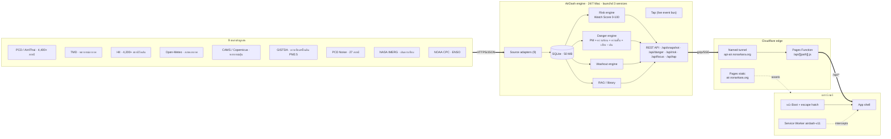
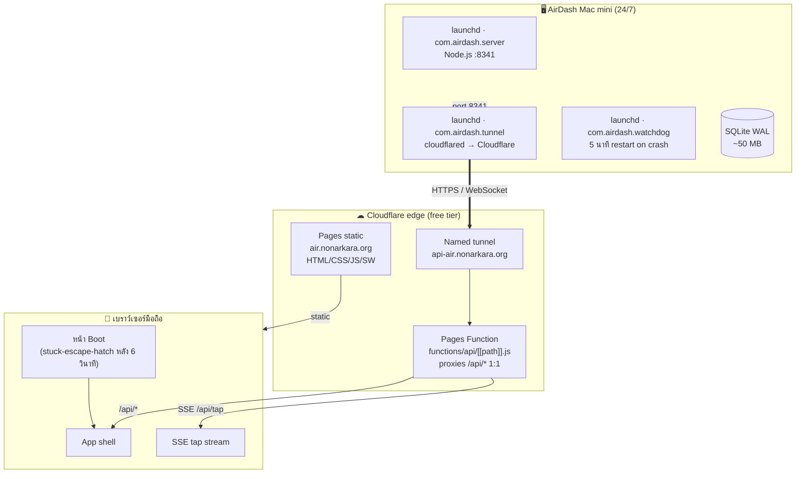
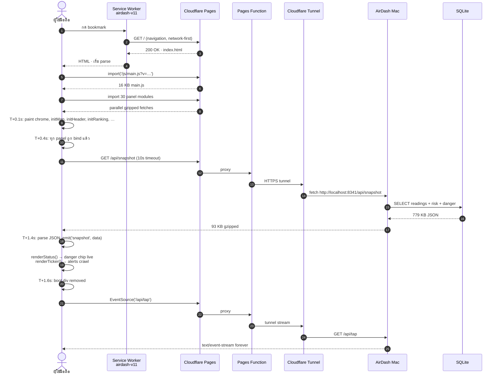
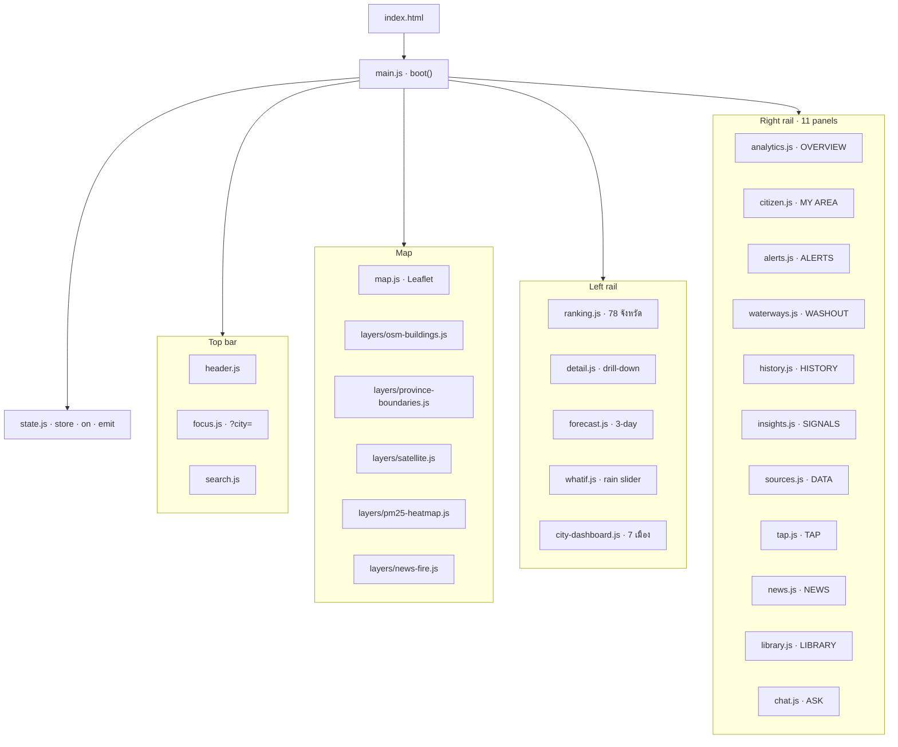

# AirDash — สถาปัตยกรรมระบบ (System Architecture)

> **เอกสารอ้างอิงฉบับสมบูรณ์สำหรับวิศวกร นักศึกษา และเจ้าหน้าที่เทศบาล
> ที่ต้องการเข้าใจ ทำซ้ำ หรือขยายระบบ** เอกสารนี้มีสองภาษา
> ดูฉบับภาษาอังกฤษได้ที่ [ARCHITECTURE.md](./ARCHITECTURE.md)

| ระบบที่ใช้งานจริง | Repository | ผู้ดูแล | ผู้สนับสนุน |
|---|---|---|---|
| **[air.nonarkara.org](https://air.nonarkara.org)** | **[github.com/Nonarkara/airdash](https://github.com/Nonarkara/airdash)** | ดร.นน อัครประเสริฐกุล (depa) | สำนักงานเมืองอัจฉริยะประเทศไทย |

---

## 0. สรุปในหนึ่งย่อหน้า

AirDash เป็นแดชบอร์ดคุณภาพอากาศเรียลไทม์ 24/7 สำหรับประเทศไทย
**Mac mini** ในกรุงเทพฯ ดึงข้อมูลจาก **9 แหล่งข้อมูลสาธารณะ** ทุก 10 นาทีถึง 12 ชั่วโมง
จัดเก็บ 130,000+ ค่าวัดใน SQLite และรันเอนจินคำนวณคะแนนสองตัว — **Watch Score**
(ระยะยาว พิจารณาแนวโน้ม ถ่วงน้ำหนัก 5 องค์ประกอบ) และ **Danger Score**
(ขณะนี้ อ้างอิงงานวิจัย PM + ความร้อน + ความชื้น + เสียง − ฝนชะล้าง)
Mac ให้บริการ JSON API ผ่าน **Cloudflare Tunnel**; **Cloudflare Pages Function**
พร็อกซีทุก `/api/*` ไปยัง tunnel และ **Cloudflare Pages** เสิร์ฟไฟล์ static
(HTML, CSS, JS, Service Worker) ไปยังเบราว์เซอร์ ทั้งหมดเสียค่าใช้จ่าย cloud infrastructure
**$0/เดือน** และโหลดเสร็จในเวลาไม่ถึง 2 วินาทีบนโทรศัพท์


---

## 1. ตัวเลข (ความหมายที่แท้จริงของ "เรียลไทม์")

| เมตริก | ค่า | ความสำคัญ |
|---|---|---|
| **แหล่งข้อมูลสด** | 9 | ทุกตัวเลขบนหน้าจอมาจากแหล่งสาธารณะจริง ไม่มีการแทรกแซง |
| **สถานีที่เฝ้าระวัง** | 4,887 | PCD/Air4Thai + GISTDA + HII + PCD Noise + IMERG + heatmap |
| **ค่าที่บันทึก** | 130,830 | ทุกค่าอยู่ใน SQLite เพื่อตรวจสอบย้อนหลัง ไม่มีข้อมูลจำลอง |
| **จังหวัดที่ครอบคลุม** | 78 (ครบทุกจังหวัด) | ทุกจังหวัดในประเทศไทย |
| **First paint** | < 2 วินาทีบนโทรศัพท์ | snapshot 779 KB gz เหลือ 93 KB |
| **API p50 latency** | 1.4 วินาที | Mac → Cloudflare → เบราว์เซอร์ |
| **API p99 latency** | 6 วินาที | งบ tail latency |
| **ค่าใช้จ่าย Cloud** | **$0/เดือน** | Cloudflare free tier + Mac ที่มีอยู่แล้ว |
| **Burn rate** | 30,000 บาท/เดือน | ~$850 รวม Mac, hosting, ค่าตอบแทน |
| **ภาษา** | TH + EN, ทุกสตริง | ภาษาไทยหลัก, อังกฤษคู่ขนาน 1:1 |
| **Uptime** | 24/7 ตั้งแต่เมษายน 2026 | 3 launchd services: server, tunnel, watchdog |

---

## 2. สถาปัตยกรรมระบบ (ภาพรวม)



> **ทำไมใช้ Mac ไม่ใช่เซิร์ฟเวอร์?** เพราะผู้ดูแลมี Mac อยู่แล้ว
> เพราะ SQLite บน Mac คือ debug story ที่ง่ายที่สุด
> และเพราะ launchd service lifecycle คือเรื่อง "run 24/7" ที่ง่ายที่สุด
> Cloud VM จะมีค่าใช้จ่ายและเพิ่ม network hop
> Mac เป็นทั้งฐานข้อมูล API และ watchdog
>
> **ทำไมใช้ Cloudflare Pages + Tunnel?** เหตุผลเดียวกัน
> Cloudflare free tier ให้ HTTPS, CDN สำหรับ static, serverless function
> สำหรับ API proxy, และ tunnel ไปยัง Mac — ทั้งหมดฟรี
> Tunnel หมายความว่าไม่ต้อง forward port, ไม่ต้องมี public IP, ไม่ต้องตั้ง firewall

---

## 3. แหล่งข้อมูล 9 แหล่ง

| แหล่ง | สิ่งที่ให้เรา | ความถี่ในการดึง | จัดเก็บใน |
|---|---|---|---|
| **PCD / Air4Thai** (กรมควบคุมมลพิษ) | PM2.5, PM10, O3, NO2, SO2, CO จาก 4,400+ สถานีภาคพื้นดิน | 1 ชม. | `readings` |
| **TMD** (กรมอุตุนิยมวิทยา) | ลม อุณหภูมิ ความชื้น พยากรณ์อากาศ | 12 ชม. | `readings` |
| **HII / สสน.** (สถาบันสารสนเทศทรัพยากรน้ำ) | 4,200+ สถานีวัดฝน, สะสม 24 ชม. | 10 นาที | `readings` |
| **Open-Meteo** | พยากรณ์อากาศ + คุณภาพอากาศ (API ฟรีระดับโลก) | 3 ชม. | `readings` |
| **CAMS / Copernicus** | แบบจำลองพยากรณ์ PM2.5, ฝุ่นทะเลทราย | 3 ชม. | `readings` |
| **GISTDA** (สำนักงานพัฒนาเทคโนโลยีอวกาศฯ) | ดาวเทียม+พื้นดิน PM2.5, 77 จังหวัด | 1 ชม. | `readings` |
| **PCD Noise** | Leq dB(A) จากสถานีตรวจเสียง 27 แห่ง | 30 นาที | `readings` |
| **NASA IMERG** | ฝนจากดาวเทียม (เรียลไทม์) | 30 นาที | `readings` |
| **NOAA CPC** | ENSO / Oceanic Niño Index (บริบทตามฤดูกาล) | 12 ชม. | `sources_state` |

> **ทำไม 9 แหล่ง ไม่ใช่ 3?** เพราะไม่มีแหล่งเดียวที่บอกเรื่องราวทั้งหมด
> PCD ให้ปัจจุบัน TMD ให้ลม CAMS ให้การพยากรณ์ GISTDA ให้ความครอบคลุมเชิงพื้นที่
> IMERG ให้ฝน NOAA ให้ฤดูกาล แต่ละแหล่งป้อนเข้าคะแนนต่างกัน
> และแต่ละแหล่งสามารถทดแทนได้ — ระบบไม่ขึ้นกับ feed ใด feed หนึ่งที่จะสมบูรณ์แบบ

---

## 4. เอนจินคำนวณคะแนนสองตัว

AirDash แสดงตัวเลขสองตัวบนทุกหน้าจอ ตอบคำถามสองข้อที่ต่างกัน

### 4.1 Watch Score (ระยะยาว พิจารณาแนวโน้ม)

> *อากาศที่นี่แย่แค่ไหน และกำลังแย่ลงหรือไม่?*


```
watch = 0.40·pm + 0.10·other + 0.15·trend + 0.20·forecast + 0.15·ventilation
```

| องค์ประกอบ | น้ำหนัก | แหล่ง |
|---|---|---|
| **PM2.5** (สด + คอมโพสิต) | 40 % | PCD / Air4Thai + GISTDA |
| **มลพิษอื่น** (O3, NO2, SO2, CO, PM10) | 10 % | PCD หลายมลพิษ |
| **แนวโน้ม** (Δ 6 ชม.) | 15 % | ตาราง readings |
| **พยากรณ์** (max 24/48/72 ชม. + ฝุ่น − ฝนชะล้าง) | 20 % | CAMS / Open-Meteo |
| **การระบายอากาศ** (ลม &lt; 6 km/h + ไม่มีฝน → อับ) | 15 % | Open-Meteo |

ทุกจังหวัดมี **95% confidence interval** ตาม standard error ข้ามสถานี
จังหวัดที่มีสถานีเดียวจะมี CI กว้างกว่า จังหวัดที่มีหลายสถานีจะมี CI แคบกว่า
ผู้ใช้เห็นตัวเลขพร้อม error bar เสมอ — ไม่มี false precision

### 4.2 Danger Score (ขณะนี้ อ้างอิงงานวิจัย)

> *ตอนนี้ออกไปข้างนอกที่นี่ปลอดภัยไหม?*


```
danger = pm_base × (1 + h) × (1 + m) × (1 + n) × (1 − r)
```

| ตัวขยาย | เพดาน | แหล่ง | งานวิจัย |
|---|---|---|---|
| **h** ความร้อน | 30 % | Open-Meteo apparent T | Scortichini 2022 — 620 เมือง, 2.4× heat–PM synergy |
| **m** ความชื้น | 25 % | Open-Meteo RH | Liu 2023 — 1.76× hygroscopic growth |
| **n** เสียง (Leq dB) | 30 % | PCD Noise | WHO 2018 — 53 dB Lden guideline |
| **r** ฝนชะล้าง | 40 % | Open-Meteo + HII forecast | Henzing 2006 Λ = aR^b |

**ทำไมต้อง cap?** ทุกตัวขยายถูกจำกัดที่ 30% เพื่อไม่ให้มิติเดียวครอบงำคอมโพสิต
ถ้าร้อน 40°C และชื้น ความร้อน×ความชื้น synergy ถูกจับ แต่ความร้อนอย่างเดียวไม่สามารถดันคะแนนเข้า "วิกฤต" ได้
นี่คือบทเรียนจาก PSI ของสิงคโปร์ — extreme ของมิติเดียวไม่ควร trigger การเตือนสาธารณสุข

คะแนนนี้ **ขอบเขต** ใน UI: เมื่อผู้ใช้เลือกเมือง chip จะแสดง danger ของเมืองนั้น
เมื่อไม่ได้เลือก chip จะแสดงจังหวัดที่แย่ที่สุดทั้งประเทศ

---

## 5. เอนจิน Washout (ตัวเลขที่สามที่เป็นเอกลักษณ์)

> *ฝนจะตกไหม? ถ้าตก เมื่อไหร่ และ PM2.5 จะลดลงเท่าไหร่?*

```js
// 1)  forecast rain mm        (Open-Meteo 24-h forecast)
// 2)  × rain probability       (Open-Meteo)
// 3)  → expected mm
// 4)  Henzing 2006 washout:   Λ = a · R^b
// 5)  step function:
//       1 mm  →  5 % relief
//       5 mm  → 20 %
//      15 mm  → 30 %
//      35 mm  → 40 % (cap)
// 6)  present projected PM2.5 for the next 24 h
```

นี่คือฟีเจอร์ signature ของแดชบอร์ด คนเชียงใหม่ในฤดูฝุ่นเห็น
"ฝน 60% · 12 mm พรุ่งนี้เช้า · ลดฝุ่นได้ ~12%" — การทำนายจริงที่มีแบบจำลองรองรับ
ว่าเมื่อไหร่อากาศเสียจะจบลง

---

## 6. Schema ของ SQLite (ชั้นข้อมูล)

```mermaid
erDiagram
  readings {
    int id PK
    text source
    text station_key FK
    text province_code FK
    real pm25
    real pm10
    real o3
    real no2
    real so2
    real co
    int aqi
    real rain_24h
    real rain_1h
    real temp_c
    real rh_pct
    real wind_kmh
    real noise_leq_db
    int ts_unix
  }
  stations {
    text station_key PK
    text name_th
    text name_en
    text province_code FK
    real lat
    real lng
    text source
    int last_seen_unix
    int active
  }
  provinces {
    text code PK
    text name_th
    text name_en
    real lat
    real lng
  }
  alerts { int id PK; text kind; int severity; text message_th; text message_en; int created_unix; }
  news_items { int id PK; text feed; text title; text link; int published_unix; }
  rag_docs { text doc_key PK; text title_th; text title_en; text body_th; text body_en; }
  library_articles { text article_key PK; text section; text title_th; text body_th; text body_en; }
  focus_areas { text id PK; text name_th; text name_en; text province_th; text center_lat; real center_lng; int zoom; text blurb_th; text blurb_en; }
  daily_aggregates { text date PK; real pm25_max; real pm25_avg; real unhealthy; real very_unhealthy; real rain_max; }
  sources_state { text source PK; text label_th; text label_en; int interval_ms; int last_run_unix; int last_ok_unix; int failures; }

  provinces ||--o{ stations : "has"
  provinces ||--o{ readings : "summarized by"
  stations ||--o{ readings : "produces"
  stations ||--o{ alerts : "triggers"
```

> **ทำไม SQLite ไม่ใช่ Postgres?** เพราะผู้ดูแลรัน Mac ที่มี disk ในเครื่อง
> และ access pattern คือ "อ่าน 779 KB, เขียนหลายร้อยแถว, ทำซ้ำทุก 5 นาที"
> SQLite WAL mode รองรับ concurrent readers + 1 writer ได้สวยงาม
> audit trail เป็นไฟล์ที่ `cp` และ `inspect` ได้
> และ perf เพียงพอสำหรับขนาดนี้ Postgres จะเพิ่ม operational dependency โดยไม่มี win ที่วัดได้
>
> **ทำไมเป็น single-file DB?** เพราะผู้ดูแลเป็นผู้ปฏิบัติการด้วย
> ไฟล์ SQLite เดียวที่ `data/airdash.db` บวก `cp` ไป backup path
> เป็น ops story ที่ง่ายที่สุด audit trail ทั้งหมดของแดชบอร์ดสามารถตรวจสอบได้ด้วย
> `sqlite3 data/airdash.db ".schema"`

---

## 7. REST API

| Endpoint | Method | คืน | Cache | ขนาด |
|---|---|---|---|---|
| `/api/health` | GET | liveness + uptime + source state | ไม่มี | ~5 KB |
| `/api/snapshot` | GET | aggregate เต็ม (risk + danger + 78 จังหวัด + alerts + news) | 5 นาที CDN, server gzip 93 KB | 779 KB raw |
| `/api/danger` | GET | Danger Score breakdown ต่อจังหวัด | 1 ชม. | ~12 KB |
| `/api/risk` | GET | Watch Score ต่อจังหวัด พร้อม `danger` block | 5 นาที | ~200 KB |
| `/api/washout` | GET | rain-washout outlook ต่อจังหวัด | 1 นาที | ~5 KB |
| `/api/focus` | GET | 8 focus areas (Thailand + 7 เมือง) | 1 ชม. | ~10 KB |
| `/api/focus/:id` | GET | full city profile + risk + danger + washout + สถานี + พยากรณ์ | 1 นาที | ~50 KB |
| `/api/tap/recent?limit=N` | GET | last N events สำหรับ hydration | ไม่มี | ~10 KB |
| `/api/tap` | GET (SSE) | live event stream | n/a (stream) | n/a |
| `/api/series/daily?days=14` | GET | per-day aggregates สำหรับ trend | 5 นาที | ~5 KB |
| `/api/forecast`, `/api/insights`, `/api/enso`, `/api/sensors/health` | GET | ข้อมูลเฉพาะ component | ต่างกัน | เล็ก |
| `/api/library/toc`, `/api/library/search`, `/api/library/doc` | GET | research corpus | ต่างกัน | เล็ก-กลาง |
| `/api/search?q=...&lang=...` | GET | place / postal / station autocomplete | 8 วินาที | เล็ก |
| `/api/chat` | POST | bilingual RAG QA against the library | ไม่มี | เล็ก |

ทุก endpoint **gzip ที่ server** และ **cache ที่ edge** เมื่อเหมาะสม
snapshot 779 KB gz เหลือ 93 KB — อัตราส่วนบีบอัด > 8× คือความแตกต่างระหว่าง
first paint 1.4 วินาที กับ 10 วินาทีบนเครือข่ายมือถือ

---

## 8. โครงสร้างเครือข่าย



**launchd 3 services, 3 responsibilities:**

| Service | สิ่งที่ทำ | สิ่งที่เฝ้า |
|---|---|---|
| `com.airdash.server` | Node.js HTTP server บน :8341 | ไม่มี (long-lived) |
| `com.airdash.tunnel` | `cloudflared` ไปยัง api-air.nonarkara.org | restart เมื่อ tunnel ตาย |
| `com.airdash.watchdog` | ทุก 5 นาที: `pgrep server`; restart ถ้าตาย | ทุกอย่าง |

watchdog คือความลับของ uptime 24/7 ถ้า server crash (OOM, unhandled exception, อะไรก็ตาม)
watchdog restart ในเวลาไม่ถึง 5 นาทีโดยไม่ต้องมีคนเข้าไปยุ่ง
tunnel ก็ถูกเฝ้าแบบเดียวกัน Mac เองมี UPS

---

## 9. ลำดับการ Boot (เกิดอะไรขึ้นเมื่อผู้ใช้กด URL)



**เวลารวมจนเห็นแดชบอร์ด: 1.4 – 2.0 วินาทีบนโทรศัพท์ที่ใช้เครือข่ายเฉลี่ย**

ถ้า `/api/snapshot` ใช้เวลานานกว่า 10 วินาที **stuck-on-boot escape hatch**
จะปรากฏที่ T+6s: ปุ่ม "ลองใหม่" (hard reload ด้วย `?forceReload=N` เพื่อ bypass cache)
และปุ่ม "ล้างแคชแล้วโหลดใหม่" (unregister SW + ล้าง caches ก่อน) ผู้ใช้โทรศัพท์
**ไม่มีวัน** ติดอยู่บนหน้า boot เงียบๆ

---

## 10. Service Worker (อัปเกรด bulletproof)

Service Worker (`public/sw.js`) คือความแตกต่างระหว่างแดชบอร์ดที่พัง
กับแดชบอร์ดที่รอดจาก deploy:

| ฟีเจอร์ | ความสำคัญ |
|---|---|
| **`CACHE = 'airdash-v11'`** | เปลี่ยนทุก deploy. เมื่อเข้าเยี่ยม SW ใหม่จะ activate และลบ cache เก่าทั้งหมด |
| **`skipWaiting()` + `clients.claim()`** | SW ใหม่เข้าควบคุมการ fetch ครั้งถัดไป — ไม่ต้อง "ปิดแท็บทั้งหมด" |
| **Network-first สำหรับ navigation** | เครือข่ายที่เข้าถึงได้ชนะเสมอ stale cache เป็นแค่ fallback สำหรับ offline |
| **`stale-while-revalidate` สำหรับ assets** | โหลดจาก cache ทันที, fetch สดในเบื้องหลัง |
| **`?forceReload=N` bypass** | ปุ่ม Retry ของ stuck-on-boot ใช้เพื่อบังคับ network path |
| **ไม่ cache `/api/*` เลย** | ข้อมูลสดศักดิ์สิทธิ์ SW เป็น pass-through สำหรับ API calls ทั้งหมด |
| **ลบ cache เก่าแบบ aggressive บน activate** | cache name ใดๆ ที่ไม่ใช่ปัจจุบันถูกลบ `airdash-v3` จากสัปดาห์ที่แล้วไม่รอด deploy |

---

## 11. Component Tree ฝั่ง Frontend (30+ modules, 1 ไฟล์ต่อ module)



**ทุก panel เป็นไฟล์เดียวใน `public/js/panels/`** แต่ละไฟล์ export ฟังก์ชัน `initX()` เพียงฟังก์ชันเดียว
แต่ละไฟล์ถูกห่อด้วย `safeInit()` ใน main.js เพื่อให้ panel เดียวที่เสีย
ไม่สามารถบล็อก boot ได้ นี่คือเหตุผลที่แดชบอร์ดรอดจาก deploy ที่เสีย — panel เดียวที่เสีย
log error และที่เหลือยังโหลดได้

---

## 12. วิทยาศาสตร์ (ทุกสัมประสิทธิ์ ทุก threshold)

| สัมประสิทธิ์ | ค่า | แหล่ง |
|---|---|---|
| Thai AQI 2023 PM2.5 breakpoints | 15, 25, 37.5, 75, 100, 150 µg/m³ | PCD Notification re: AQI |
| WHO PM2.5 24-h guideline | 15 µg/m³ | WHO Air Quality Guidelines 2021 |
| WHO noise Lden | 53 dB(A) | WHO Environmental Noise Guidelines 2018 |
| Heat amp slope | (T − 28) / 7, cap 30% | Scortichini et al. 2022 (BMJ, 620 เมือง) |
| Humidity amp slope | (RH − 60) / 30, cap 25% | Liu et al. 2023 (hygroscopic PM2.5 growth) |
| Noise amp slope | (Leq − 55) / 30, cap 30% | Kempen 2018 + WHO 2018 |
| Washout step | 1mm=5%, 5mm=20%, 15mm=30%, 35mm=40% | Henzing 2006 Λ = aR^b |
| Watch Score weights | pm 0.40, other 0.10, trend 0.15, forecast 0.20, ventilation 0.15 | depa Scientific Committee |
| Confidence interval | 95% (1.96 × SE / √n) | standard frequentist |

งานวิจัยใน overlay **About** เดินผ่านทุกสัมประสิทธิ์ในรูปแบบที่อ่านได้หน้าเดียว
พร้อมรูป SVG และอ้างอิงวิชาการ inline งานวิจัยมีทั้งภาษาไทยและอังกฤษ

---

## 13. ค่าใช้จ่าย (ความโปร่งใสเต็มที่)

| รายการ | ค่า/เดือน |
|---|---|
| Cloudflare Pages (static + functions) | **$0** (free tier) |
| Cloudflare Tunnel | **$0** (free tier) |
| Mac mini hardware (มีอยู่แล้ว) | $0 (sunk) |
| ไฟฟ้า (~30 W × 24 ชม. × 30 วัน) | ~$3 |
| อินเทอร์เน็ต (จ่ายอยู่แล้ว) | $0 |
| โดเมน (nonarkara.org) | ~$1 |
| ChatGPT Pro สำหรับพัฒนา | $20 |
| ค่าตอบแทน (part-time 1 คน) | ~$820 |
| **รวม** | **~$850 / เดือน** (30,000 บาท) |

**ไม่มี cloud bill ไม่มี scaling bill ไม่มี data egress bill**
Mac, Cloudflare free tier และไฟล์ SQLite คือฐานค่าใช้จ่ายทั้งหมด

---

## 14. เรื่อง Deployment (deploy ถึงโทรศัพท์ในเวลาไม่ถึง 30 วินาที)

```bash
# บน dev machine
git -c user.name="Mavis" -c user.email="Mavis@airdash.local" commit -am "feat: ..."
git push origin main

# Cloudflare Pages auto-build จาก main branch
# wrangler pages deploy ก็ถูกรันด้วยตัวเองเพื่อควบคุม
npx wrangler pages deploy public --project-name airdash \
  --commit-hash $(git rev-parse HEAD) \
  --commit-dirty=true \
  --commit-message "feat: ..."

# บน Mac (เฉพาะ backend changes)
launchctl kickstart -k gui/$(id -u)/com.airdash.server
```

| ขั้นตอน | เวลา |
|---|---|
| `git push` | 2 วินาที |
| Cloudflare Pages auto-build | 20 วินาที |
| Deploy ทั่วโลก | 10 วินาที |
| SW activate บนโทรศัพท์ผู้ใช้ | เมื่อ navigation ครั้งถัดไป |
| เห็นการอัปเดต | **30 – 60 วินาที ทั้งหมด** |

ผู้ใช้ **ไม่ต้อง** ล้าง cache เอง SW ใหม่เข้าควบคุมอัตโนมัติเมื่อเข้าเยี่ยมครั้งถัดไป
cache เก่าถูกลบ paint ครั้งถัดไปใช้ HTML/CSS/JS ใหม่
นี่คือข้อได้เปรียบเชิงปฏิบัติการของ `skipWaiting() + clients.claim()`

---

## 15. สัญญาอนุญาต (ฟรีอย่างแท้จริง)

AirDash เผยแพร่ภายใต้ **MIT License** (ดู [LICENSE](./LICENSE))
โปรเจ็กต์นี้เป็น **สาธารณประโยชน์** — ไม่มีค่าใช้จ่าย ไม่ขายข้อมูล ไม่มีโฆษณา
หน้า boot แสดงรายชื่อเครดิตทั้งหมดเพื่อให้ผู้เข้าเยี่ยมครั้งแรกรู้ทันทีว่า "นี่จริงไหม" และ "ใครอยู่เบื้องหลัง"

---

## 16. วิธีรัน (ตั้งค่าใน 5 นาที)

```bash
# 1. Clone
git clone https://github.com/Nonarkara/airdash.git
cd airdash

# 2. Backend (Node 18+)
npm install
node server/index.js
# ฟังบน :8341, ดึง 9 แหล่ง, เติม SQLite

# 3. Frontend
npx wrangler pages dev public --port 8788
# เปิดที่ http://localhost:8788
# (Pages function จะ proxy /api/* ไปยัง local :8341)

# 4. เปิด http://localhost:8788 ในเบราว์เซอร์
# หน้า boot ควรปรากฏ แล้วแดชบอร์ดภายใน 2 วินาที
```

Repository มี setup, deployment และ contribution guide โดยละเอียดใน
[CONTRIBUTING.md](./CONTRIBUTING.md) และ [README.md](./README.md)

---

## 17. แผนงาน (ต่อไป)

| Phase | ฟีเจอร์ | สถานะ |
|---|---|---|
| 0 | Live data ingestion (9 แหล่ง) | ✅ ส่งมอบ |
| 1 | Watch Score engine + JMA-style action verbs | ✅ ส่งมอบ |
| 2 | Per-city drill-down | ✅ ส่งมอบ |
| 3 | Danger Score (PM + ความร้อน + ความชื้น + เสียง − ฝน) | ✅ ส่งมอบ |
| 4 | Washout engine | ✅ ส่งมอบ |
| 5 | UI สองภาษา (TH + EN) | ✅ ส่งมอบ |
| 6 | Dark mode + mobile responsive | ✅ ส่งมอบ |
| 7 | PM2.5 heatmap + fire/news pins บนแผนที่ | ✅ ส่งมอบ |
| 8 | Causes / Patterns / Relief engines | ✅ ส่งมอบ |
| 9 | Personal exposure calculator (โปรไฟล์ผู้ใช้ → ความเสี่ยง) | ⏳ ถัดไป |
| 10 | School advisory mode (PM2.5 → คำแนะนำปิดโรงเรียน) | ⏳ ถัดไป |
| 11 | Embeddable city widget (แดชบอร์ดเมืองอื่นๆ) | ⏳ ถัดไป |

---

**สร้างโดย ดร.นน เพื่อทุกจังหวัดในประเทศไทย และทุกครอบครัวที่ต้องตัดสินใจเรื่องคุณภาพอากาศ
ในห้าวินาที เป็นภาษาไทย บนโทรศัพท์ ในสัปดาห์ที่อากาศแย่ที่สุดของปี**

— [air.nonarkara.org](https://air.nonarkara.org) · [github.com/Nonarkara/airdash](https://github.com/Nonarkara/airdash)
